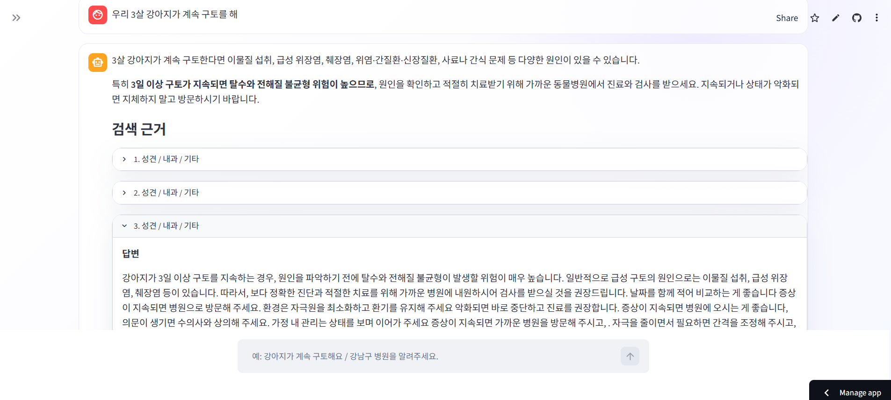
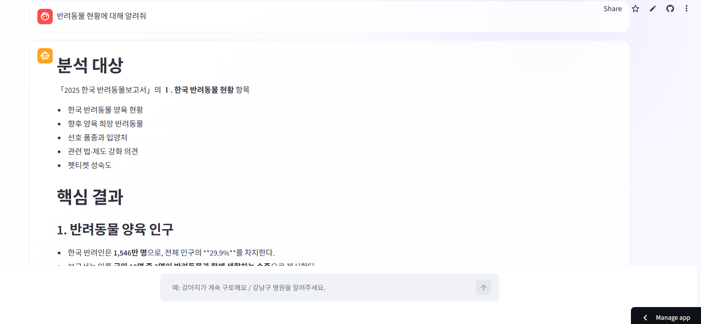
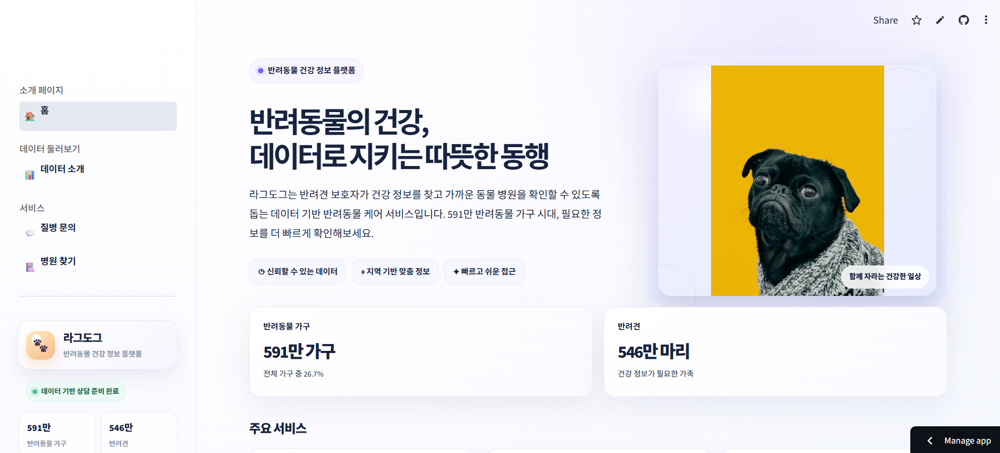
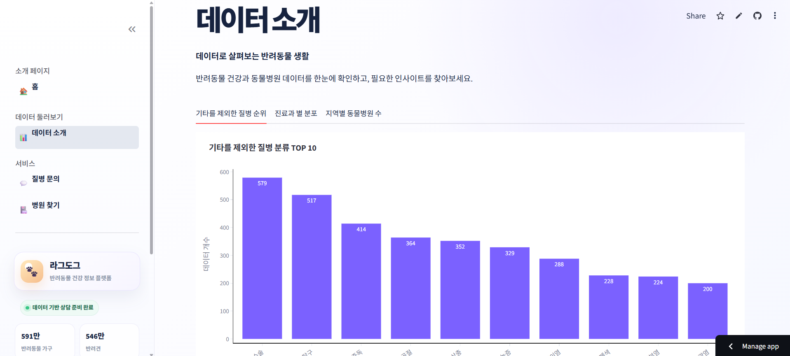
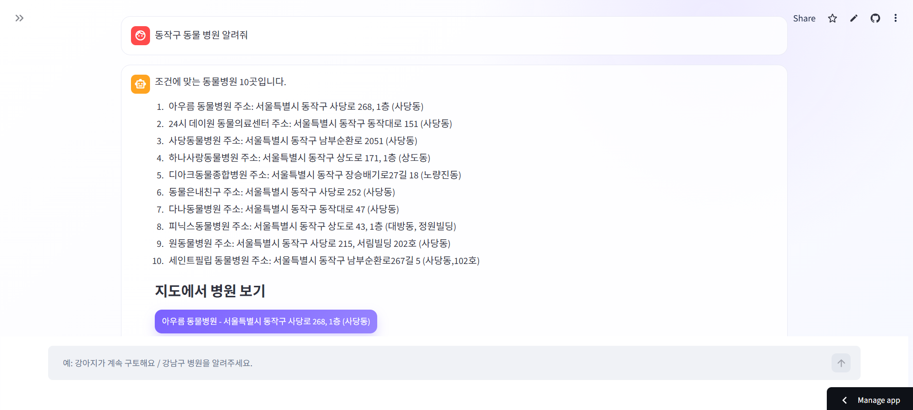
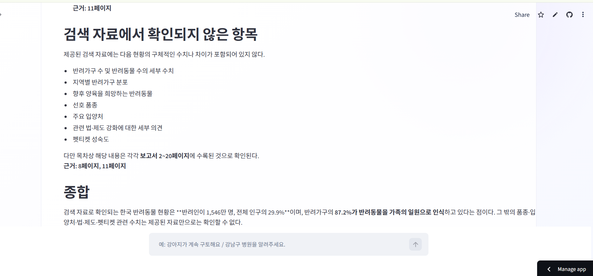
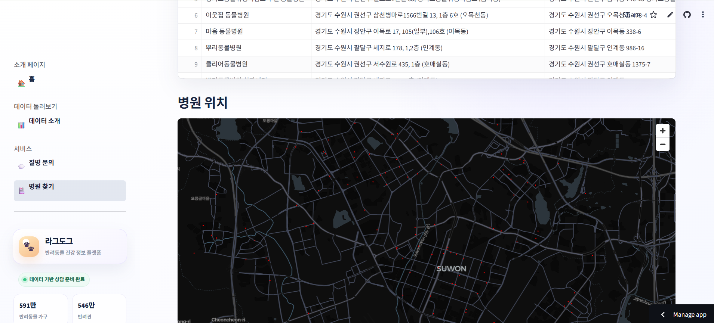

# 🐾 라그도그 (RagDog)

> 반려견 건강 상담, 동물병원 검색, 반려동물 보고서 분석을 하나의 챗봇으로 제공하는 RAG 서비스입니다. 근거가 없으면 지어내지 않고 답변을 보류합니다.

- **배포 앱:** <https://dograg-n4gxibufynkgiuixfrkx2v.streamlit.app/rag>
- **설계 기록(위키):** [`docs/wiki/`](docs/wiki/README.md). 실험 수치, 채택·기각 이유, 미해결 과제를 모았습니다.
- 프로젝트 노션: <https://app.notion.com/p/3b5fceb573c380ea8488c7936f77f6d5>
- 발표 당시 버전: <https://mle-01-p1-team2-f5fqyncuwejycn4hyrp64b.streamlit.app/rag> (`encore-ai-campus/mle-01-p1-team2`, 아래 개선 이전)

> 의료 판단이나 응급 처치를 대신하지 않습니다. 위급하거나 증상이 지속·악화되면 동물병원에 문의해야 합니다.

## 한눈에 보기

엔코아 AI 캠퍼스 4인 팀 프로젝트(2026-08)로 만들었습니다. 발표 이후(2026-09~10) 오현탁이 검색 품질, 답변 신뢰성, 배포 안정성을 측정하며 개선했습니다.

| 개선 항목 | 이전 | 이후 | 측정 |
| --- | ---: | ---: | --- |
| 건강 검색 `hit@3` | 0.2264 | **0.2620** | 검증 Q&A 561건, Dense → Dense+BM25 하이브리드 |
| 근거 없는 질문에 답변 보류 | 0/20 | **16/20** | 60문항 평가, CRAG 적용 |
| 답할 수 있는 질문의 과잉 보류 | – | **1/19** | 같은 평가 |
| 라우터 오분류 | 4/60 | **0/60** | 같은 평가 |
| 서버 재시작 후 첫 답변 대기 | 약 165초 | **약 8초** | 로컬, 페이지를 연 지 1분 뒤 질문 |
| 저장소의 벡터 DB 크기 | 681MB | **209MB** | `data/chroma_db/` |
| 최대 메모리 | 1,817MB | **1,587MB** | 로컬, Cloud 한도 2.7GB |

`hit@3`는 검색 문서의 연령 단계·진료과·질병이 질문과 모두 일치하는 비율입니다. 의료적 정확도를 뜻하지 않습니다.

**기술:** LangGraph · LangChain · Chroma · `jhgan/ko-sroberta-multitask` · Kiwi + BM25 · OpenAI (`gpt-6-luna`, `text-embedding-3-small`) · SQLite · Streamlit Community Cloud · GitHub Actions

## 데모

배포 앱의 `rag` 페이지에서 바로 질문할 수 있습니다.

| 질문 예시 | 경로 | 동작 |
| --- | --- | --- |
| 강아지가 이틀째 설사를 해요 | 건강 상담 | 유사 상담 사례를 근거로 답하고 근거 목록을 보여 줌 |
| 햄스터가 해바라기 씨를 먹어도 되나요? | 건강 상담 | 강아지 상담 자료에 근거가 없어 **답변 보류** |
| 동작구 동물병원 알려줘 | 병원 검색 | SQLite에서 최대 10곳, 버튼으로 지도 이동 |
| 반려동물 장묘 서비스 이용 실태를 알려줘 | 보고서 분석 | 보고서 이름·페이지를 인용해 요약, 원문 PDF 페이지 미리보기 |

근거가 없을 때의 실제 응답(배포 앱, 2026-10-05):

```text
검색된 상담 자료에서 이 질문에 답할 근거를 찾지 못해 답변을 드리지 않았습니다.
증상이 계속되거나 걱정되면 가까운 동물병원에 문의해 주세요.
[가까운 동물병원 찾기]
```

| 건강 상담과 검색 근거 | 보고서 분석 |
| --- | --- |
|  |  |

<details>
<summary>화면 더 보기 (홈, 대시보드, 병원 검색, 지도)</summary>












</details>

## 아키텍처


- 챗봇은 LangGraph `StateGraph`입니다(`src/chat_graph.py`). 질문 분류, 검색, 근거 평가, 재작성, 답변, 보류가 각각 노드입니다.
- 건강 상담만 CRAG를 거칩니다. 보고서 분석은 측정해 보니 CRAG가 오히려 정답 근거를 걸러 내서 적용하지 않았습니다(아래 결정 3).
- 병원 정보는 정확한 조건 검색이 중요하므로 벡터 검색 대신 SQLite 읽기 전용 조회를 씁니다.

## 기술적 결정 5가지

### 1. 검색: Dense만 쓰다가 Dense + BM25 하이브리드로

- **문제:** 기존 Dense 검색의 `hit@3`는 0.2264였습니다. 키워드만 쓰는 BM25를 따로 측정하자 0.2531로 오히려 높았습니다. 이 데이터에서는 질병명·증상명 같은 명사 일치가 중요하다는 뜻입니다.
- **선택:** Kiwi 형태소 분석으로 명사·외국어·숫자만 뽑아 BM25 색인을 만들었습니다. Dense 후보 12건과 BM25 후보 12건을 RRF(c=60)로 합칩니다.
- **결과:** 검증 Q&A 561건에서 `hit@3`가 0.2264에서 0.2620으로 올랐고, 미적중은 434건에서 414건으로 줄었습니다.
- **대가:** 검색 지연이 약 4배(평균 171ms → 704ms, 로컬)로 늘었습니다.
- **기각한 대안:**
  - 문자 n-gram 재정렬: `hit@3` 0.2228로 개선이 없었습니다.
  - RRF 가중치 조정: 튜닝셋에서 고르고 홀드아웃에서 검증했지만 개선이 없었습니다.
  - [실험 기록](docs/wiki/retrieval-experiments.md)

### 2. 임베딩은 데이터마다 따로 고른다

- **문제:** 메모리를 줄이려고 건강 Q&A 임베딩도 OpenAI로 바꾸는 방안을 검토했습니다.
- **측정:** 같은 벤치마크에서 하이브리드 `hit@3`가 0.2674에서 0.2353으로 떨어졌습니다. BM25 단독(0.2496)보다도 낮았습니다.
- **결정:** 구어체 짧은 질문인 건강 Q&A는 한국어 모델 ko-sroberta를 유지합니다. 표와 수치가 많은 긴 보고서 PDF 5종(1,193청크)은 OpenAI `text-embedding-3-small`로 임베딩합니다.
- **함께 고친 것:** 보고서 검색어 앞에 KB 목차 항목 전체가 붙던 버그를 측정으로 찾았습니다. 고친 뒤 정답 페이지가 상위 6건에 들어가는 질문이 7/18에서 12/18로 늘었습니다.

### 3. CRAG: 지어내는 대신 근거를 평가하고 보류한다

- **문제:** 검색은 항상 무언가를 돌려줍니다. 그래서 햄스터 질문에도 강아지 상담 3건이 "검색 근거"로 화면에 나왔습니다.
- **선택:** LLM이 후보 5건 중 질문에 실제로 쓸모 있는 문서만 고릅니다. 하나도 없으면 검색어를 1번 고쳐 다시 찾고, 그래도 없으면 답변을 보류하고 병원 찾기 링크를 보여 줍니다. 출처를 검증할 수 없는 웹 검색 보완은 의료 정보라서 넣지 않았습니다.
- **v1 → v2:** 첫 버전은 판정이 너무 엄격하고 호출이 많았습니다. 판정 기준을 완화하고, 근거가 하나도 없을 때만 재작성하고, 판정에 넘기는 후보와 발췌 길이를 줄였습니다.

| 60문항 평가 (실제 모델) | CRAG 꺼짐 | v1 | **v2 (현재)** |
| --- | ---: | ---: | ---: |
| 근거 없는 건강 질문 20개 중 보류 | 0 | 16 | **16** |
| 답할 수 있는 건강 질문의 과잉 보류 | 0 | 3/17 | **1/19** |
| 토큰 (꺼짐 대비) | 1배 | 3.9배 | **2.0배** |
| 평균 지연 | 14.7초 | 22.7초 | 19.6초 |

- **보고서에는 끔:** 보고서 질문 18개에 CRAG를 켜면 정답 페이지가 근거에 포함되는 질문이 12개에서 10개로 줄었습니다. 표와 수치가 많은 청크를 LLM이 잘못 걸러 냈기 때문입니다. 설정을 `ENABLE_CRAG`(건강)와 `ENABLE_CRAG_REPORTS`(보고서, 기본 꺼짐)로 나눴습니다.
- 실행마다 경로, 판정, 재작성 횟수, 토큰 사용량을 `output/chat_runs.jsonl`에 기록합니다. 질문 원문은 저장하지 않고 해시와 길이만 남깁니다.
- [평가 기록](docs/wiki/safety-and-evidence.md), 재현: `uv run python scripts/evaluate_crag.py --crag on|off`

### 4. 라우터: 확실한 건 규칙으로, 애매한 건 LLM으로

- **문제:** 키워드 규칙은 빠르지만(중앙값 0.04ms), 고정된 우선순위로 충돌을 처리했습니다. 예를 들어 "닭 뼈를 삼켰는데 가까운 동물병원에 갈 수 없어요"는 건강 질문인데 병원 검색으로 갔습니다. 평가 60문항 중 4개가 이렇게 잘못 분류됐습니다.
- **선택:** 건강·병원·보고서 신호가 **하나뿐일 때만** 규칙으로 결정합니다. 신호가 충돌하거나 없으면 LLM 구조화 출력으로 결정합니다. API 키가 없으면 예전 우선순위로 동작합니다.
- **결과:** 오분류 4건이 모두 바로잡혔고 새로 틀린 질문은 없었습니다. LLM까지 간 질문은 60개 중 13개입니다. [라우터 기록](docs/wiki/router.md)

### 5. 무료 배포 환경(2코어, 2.7GB)에 맞추기

- **첫 답변 지연:** 원인을 재 보니 서버를 다시 시작한 뒤 첫 질문에서 19,206개 문서를 Kiwi로 토큰화하느라 약 130초가 걸렸습니다. 토큰화 결과를 캐시 파일로 저장했습니다. 캐시 키는 코퍼스 해시와 토크나이저 버전입니다. 여기에 페이지를 열면 모델과 색인을 백그라운드에서 미리 불러오도록 했습니다. 로컬 기준으로 첫 답변까지 약 165초에서 약 8초로 줄었습니다. 검증 질문 200개에서 BM25 상위 12건 결과는 모두 같았습니다.
- **저장소 크기:** Chroma가 문자열 메타데이터를 색인하면서 답변 원문이 DB를 크게 부풀렸습니다. 답변은 CSV에서 문서 ID로 읽도록 바꾸고 쓰지 않는 컬렉션을 정리했습니다. DB가 681MB에서 209MB로 줄었습니다.
- **메모리 초과 경고:** Streamlit에서 메모리 초과 메일을 받았습니다. 단계별로 측정해 보니 Kiwi 하나가 약 480MB였습니다.
  - 다어절 사전을 끄자 Kiwi가 294MB로 줄었고, 검색 `hit@3`는 그대로였습니다.
  - torch 스레드 수와 glibc malloc arena 수도 2개로 제한했습니다.
  - [자원 기록](docs/wiki/deployment-resources.md)

## 기능 상세

| 도구 | 선택되는 질문 | 동작 | 결과·제한 |
| --- | --- | --- | --- |
| 건강 상담 | 증상, 질병, 치료, 건강 정보 | 하이브리드 검색 → CRAG 근거 평가 → 근거만으로 답변 | 근거 1~5건 표시. 연령 단계·진료과·질병 필터. 호흡곤란·발작·독성물질 섭취 같은 표현에는 진료 권고를 따로 표시 |
| 병원 검색 | 병원 이름, 주소, 지역, 목록 | SQLite `hospital` 읽기 전용 조회. 위치를 허용하면 좌표 변환 후 직선거리순 정렬 | 최대 10곳. 위치 없이 "가까운 병원"을 물으면 임의의 병원을 가장 가깝다고 표시하지 않고 위치 사용이나 지역 검색을 안내 |
| 보고서 분석 | 반려동물 현황, 통계, 추이, 비교 | 보고서 컬렉션에서 6건 검색 → 확인된 수치만 요약 | 보고서 이름·페이지 인용, 원문 PDF 페이지 미리보기. 근거가 없으면 모델을 호출하지 않음 |
| 일반 대화 | 인사, 기능 문의, 날짜 | 검색 없이 짧게 응답 | |

- **위치 정보:** 버튼을 누를 때만 브라우저 권한을 요청합니다. 좌표는 현재 세션의 계산에만 쓰고 DB·파일·대화 기록에 남기지 않습니다. 거리는 직선거리이고 이동 시간이나 영업 여부는 뜻하지 않습니다.
- **API 키가 없으면:** 건강 상담은 검색 결과까지만 보여 줍니다. 보고서 분석은 질문 임베딩에도 OpenAI가 필요해서 동작하지 않습니다. 지역 키워드가 있는 병원 검색은 키 없이 동작합니다.

## 데이터

| 데이터 | 경로 | 규모 | 용도 |
| --- | --- | ---: | --- |
| 반려견 건강 Q&A | `data/df.csv` | 19,206건 | 건강 상담 원천. 연령 단계·진료과·질병 메타데이터 |
| 검증 Q&A | `data/df_val.csv` | 561건 | 검색 평가 |
| 동물병원 | `data/hospital.db` | 5,448곳 | 지역·주소·좌표 검색과 지도 |
| 반려동물 보고서 | `data/source/*.pdf` | 5개, 922페이지, 1,193청크 | KB 2025 반려동물 보고서, 반려동물 복지실태와 개선과제, 반려동물 산업 조사체계 진단 및 실태조사, 반려동물 의료보험서비스 시장 진단, 반려동물 장묘서비스 이용 실태조사 |
| 벡터 저장소 | `data/chroma_db/` | 209MB (Git LFS) | 건강 `pet_care`(ko-sroberta, 768차원), 보고서 `pet_reports_openai3small_1536_…` |
| 평가 문항 | `tests/data/crag_eval_questions.json` | 60문항 | 건강 답변 가능 20, 건강 근거 없음 20, 보고서 답변 가능 18(정답 페이지 지정), 보고서 근거 없음 2 |

출처는 AI Hub 반려견 성장·질병 말뭉치, KB경영연구소 2025 반려동물 보고서와 공공 연구 보고서, 공공데이터포털 동물병원 데이터입니다. `scripts/audit_health_data.py`로 데이터 품질을 점검했습니다. 학습 데이터의 질병 라벨 중 `기타`가 76.9%이며, 원본 라벨은 임의로 바꾸지 않았습니다.

## 프로젝트 구조

```text
.
├── main.py                 # Streamlit 진입점, 스레드·메모리 제한
├── pages/
│   ├── rag.py              # 챗봇 화면, 라우터, 검색·답변 도구
│   ├── hospital.py         # 지역 선택형 병원 목록·지도
│   ├── data.py             # 데이터 대시보드
│   └── home.py
├── src/
│   ├── chat_graph.py       # LangGraph 그래프 (라우팅, CRAG, 보류)
│   ├── crag.py             # 근거 평가·재작성·질문 분해 프롬프트와 헬퍼
│   ├── hybrid_retrieval.py # BM25 색인, RRF, 토큰 캐시
│   ├── run_log.py          # 실행 로그 (질문 해시, 토큰 사용량)
│   ├── health_safety.py    # 응급 표현 안내
│   └── ...
├── scripts/                # 평가(하이브리드, RRF 가중치, CRAG), 메모리 측정, 캐시 생성
├── tests/                  # 단위·회귀 테스트, 평가 문항
├── docs/wiki/              # 실험 수치와 설계 결정 기록
└── data/                   # CSV, SQLite, PDF, Chroma
```

## 실행 방법

Python 3.12 이상과 [uv](https://docs.astral.sh/uv/)가 필요합니다.

```bash
uv sync
```

`.streamlit/secrets.toml`(또는 `.env`)에 키를 넣습니다. 이 파일은 Git에 올리지 않습니다.

```toml
OPENAI_API_KEY = "..."
ENABLE_CRAG = "true"   # 건강 상담 CRAG (선택)
```

```bash
uv run streamlit run main.py
```

테스트와 평가:

```bash
uv run python -m unittest discover -s tests
```

```bash
uv run python scripts/evaluate_hybrid_search.py
```

```bash
uv run python scripts/evaluate_crag.py --crag on
```

```bash
uv run python scripts/measure_memory.py
```

- 단위 테스트는 외부 API를 호출하지 않습니다.
- `evaluate_crag.py`는 실제 모델을 호출하므로 비용이 듭니다.
- GitHub Actions(`.github/workflows/streamlit-ci.yml`)가 PR과 `main` push마다 테스트를 실행합니다.
- Streamlit Community Cloud는 `main` 브랜치 변경을 감지해 자동으로 다시 배포합니다.

## 한계와 다음 단계

- **평가 지표의 한계:** `hit@3`는 메타데이터 일치이고, CRAG 평가는 직접 만든 60문항입니다. 수의사 검토 같은 의료적 정확도 평가는 하지 않았습니다.
- **답변 충실도:** 답변을 주장 단위로 나눠 근거에 있는지 LLM으로 판정했습니다(인용문을 근거와 대조하고, 근거가 없다고 판정한 주장은 하나씩 다시 확인).
  - 보고서 답변은 0.95, 건강 답변은 약 0.8입니다.
  - 건강 답변에서 근거 밖 주장은 주로 단정 회피와 관리 요령이고, 근거에 없는 구체적 의학 사실은 37개 답변에서 약 6개였습니다.
  - CRAG는 이 수치를 바꾸지 않습니다. 다음 단계는 생성 프롬프트 강화입니다. [평가 기록](docs/wiki/safety-and-evidence.md)
- **검색 후보의 한계:** 정답이 후보 24건 안에 있는 비율은 61%인데 상위 3건 적중은 26%입니다. 리랭커가 유망하지만 로컬 리랭커는 Cloud CPU에서 메모리와 속도 모두 감당하기 어려워 넣지 않았습니다. CRAG 근거 평가로 재정렬하는 방법도 재 봤지만, 무작위 100문항에서 후보 5건은 효과가 없었고(0.30 → 0.30) 후보 12건은 통계적으로 의미 없는 차이였습니다(0.30 → 0.34, p=0.45). [실험 7](docs/wiki/retrieval-experiments.md)
  - CRAG는 이 수치를 바꾸지 않습니다.
  - 건강 프롬프트에 "검사·약·시기는 근거에 있을 때만, 근거의 대상을 넓히지 않기" 규칙을 넣었습니다. 근거 밖 주장이 20·10개(이전 프롬프트 두 번 실행)에서 5개로 줄었고, 근거 밖 의학 사실은 0개가 됐습니다. 대신 "자료에 없다"는 안내가 늘었습니다. [평가 기록](docs/wiki/safety-and-evidence.md)
- **검색 후보의 한계:** 정답이 후보 24건 안에 있는 비율은 61%인데 상위 3건 적중은 26%입니다. 리랭커가 유망하지만 로컬 리랭커는 Cloud CPU에서 메모리와 속도 모두 감당하기 어려워 넣지 않았습니다. 지금은 CRAG 근거 평가가 관련 문서를 골라 순서를 정하는 방식으로 일부 대신합니다.
- **CRAG 비용:** 건강 상담에서 토큰이 2배, 지연이 약 5초 늘고, 과잉 보류가 1건(배뇨 이상 질문) 남아 있습니다.
- **배포 환경:** 앱이 잠들었다가 깨어날 때의 시간은 줄이지 못했습니다. 메모리 제한 조치 중 Linux 전용 부분은 배포 앱에서 효과를 계속 확인해야 합니다.
- **병원 데이터:** 운영 여부와 최신 주소는 원본 데이터 기준입니다.
- 미해결 과제 전체: [`docs/wiki/open-questions.md`](docs/wiki/open-questions.md)

## 팀과 역할

**팀 프로젝트 (2026-08, 4인)**
- 백관민: 팀장, RAG·청킹·임베딩·검색·평가
- 오현탁: RAG·청킹·임베딩·검색·평가
- 봉기람: 데이터 수집·전처리·EDA
- 차성종: Streamlit UI·시각화·배포

**발표 이후 개선 (2026-09~10, 오현탁)**

이 저장소(`rndigkwk/dograg`)에서 한 작업입니다. 위의 결정 1~5와 아래 작업이 여기에 해당합니다.
- 하이브리드 검색 도입과 오프라인 검색 실험 6건
- 위치 기반 병원 검색
- LangGraph 전환, CRAG v1·v2 설계와 평가
- 라우터 충돌 처리
- 보고서 5종 확장과 OpenAI 임베딩 적용
- 저장소·메모리·첫 답변 지연 최적화
- CI 수정과 설계 위키 작성

자세한 변경 내역은 [`docs/changes-from-backup.md`](docs/changes-from-backup.md)에 있습니다.
