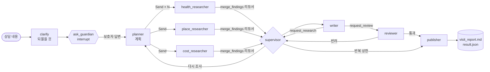

# 🐾 라그도그 (RagDog)

> 반려견 건강 상담, 반려동물 시설 검색(동물병원·약국·동반 시설 등 38,529곳), 반려동물 보고서 분석을 하나의 챗봇으로 제공하는 RAG 서비스입니다. 근거가 없으면 지어내지 않고 답변을 보류합니다.

- **배포 앱:** <https://dograg-n4gxibufynkgiuixfrkx2v.streamlit.app/rag>
- **상세 문서:** [`docs/details.md`](docs/details.md)(기능·데이터·결정 전체), [`docs/wiki/`](docs/wiki/README.md)(실험 수치, 채택·기각 이유)
- 프로젝트 노션: <https://app.notion.com/p/3b5fceb573c380ea8488c7936f77f6d5> · 발표 당시 버전: <https://mle-01-p1-team2-f5fqyncuwejycn4hyrp64b.streamlit.app/rag>

> 엔코아 AI 캠퍼스 4인 팀 프로젝트(2026-08)를 발표 이후(2026-09~10) 오현탁이 측정하며 개선했습니다. 의료 판단이나 응급 처치를 대신하지 않습니다.

## 1분 요약

**무엇을 하나**
- **건강 상담:** AI Hub 상담 19,206건에서 비슷한 사례를 찾아 근거로 답하고, 근거가 없으면 **보류**합니다. 응급 신호가 보이면 답변보다 가까운 병원을 먼저 보여 줍니다.
- **시설 찾기:** 공공데이터 6종 38,529곳을 SQL로 정확히 찾습니다. "설사하는데 마포구 동물병원 어디 있어?"처럼 물으면 병원 목록과 증상 안내를 함께 답합니다.
- **보고서 분석:** 반려동물 보고서 5종을 쪽수와 함께 인용해 요약합니다.
- **방문 준비 보고서:** 멀티에이전트 팀(계획 → 병렬 조사 → 작성 → 검수)이 수의사에게 보여 줄 보고서를 만듭니다.

**핵심 지표** (같은 평가 세트로 전후 비교, [전체 지표](docs/details.md#개선-지표-전체))

| | 이전 | 이후 |
| --- | ---: | ---: |
| 건강 검색: 쓸모 있는 문서가 상위 3건에 있는 질문 (100문항) | 0.46 | **0.72** |
| 보고서 답변: 기준 답과 맞는 답 (18문항 × 2회) | 23/36 | **30/36** |
| 근거 없는 질문 보류 / 답할 질문을 잘못 보류 (60문항) | 0/20 / – | **16/20 / 1/38** |
| 응급 신호 감지, 만들기 전에 써 둔 평가셋 (응급 20 / 비응급 20) | 1/20 / 오탐 0 | **19/20 / 오탐 0** |
| 방문 준비 보고서 검수 통과율 / 중앙 시간 (상담 12개) | 0.70 / 68초 | **1.00 / 49초** |
| 최대 메모리 / 재시작 후 첫 답변 | 1,817MB / 약 165초 | **985MB / 약 8초** |

**측정으로 원인을 찾은 사례**
1. **필터가 검색을 망치고 있었다.** 질문에서 추론한 연령·진료과 필터가 기대는 라벨이 질문 본문과 34%·59%만 맞았습니다. 필터를 빼자 적중률 0.141 → 0.264. [실험 8·9](docs/wiki/retrieval-experiments.md)
2. **보고서 답변의 병목은 검색이었다.** Parent-Child·컨텍스트 압축은 효과가 없었고, 하이브리드 검색으로 바꾸자 정답 23 → 30/36(p=0.016). [실험 10·12·13](docs/wiki/retrieval-experiments.md)
3. **에이전트 팀이 얻을 수 없는 정보를 계속 요청했다.** 재조사를 한 번으로 제한해 검수 통과율 0.70 → 1.00. [팀 기록](docs/wiki/visit-prep-team.md)
4. **응급 판단의 오탐을 실제 질문 분포로 쟀다.** "응급/아님" 2택은 보호자 질문의 32.5%에 경고했고, "지금 응급/곧 진료/아님" 3택으로 9%가 됐습니다. [기록](docs/wiki/safety-and-evidence.md)
5. **배포 장애를 자동 점검으로 막았다.** 병합 뒤 리부트를 빠뜨려 챗봇 페이지가 멈춘 일 뒤로, 모든 페이지와 챗봇 응답을 병합 직후와 8시간마다 점검합니다. [기록](docs/wiki/deployment-resources.md)

**기술:** LangGraph · LangChain · Chroma · `jhgan/ko-sroberta-multitask`(ONNX int8) · Kiwi + BM25 · OpenAI (`gpt-6-luna`, `text-embedding-3-small`, Decisions) · SQLite · Langfuse · Streamlit Community Cloud · GitHub Actions(테스트 322개, 주간 회귀 평가, 배포 점검)

## 데모

| 질문 예시 | 동작 |
| --- | --- |
| 강아지가 이틀째 설사를 해요 | 유사 상담 사례를 근거로 답하고 근거 목록을 보여 줌 |
| 햄스터가 해바라기 씨를 먹어도 되나요? | 강아지 자료에 근거가 없어 **보류**하고, 찾아본 것·없던 것·다시 묻는 법을 안내 |
| 설사가 이틀째인데 마포구 동물병원 어디 있어? | 병원 목록을 먼저(0.4초) 보여 주고, 아래에 증상 안내 |
| 입술 색이 거무스름하게 변하고 숨을 몰아쉬어요 | 답변 전에 응급 경고와 가까운 동물병원 |
| (건강 답변 아래) 이 상담으로 방문 준비 보고서 만들기 | 빠진 정보를 되묻고, 증상·병원·비용을 병렬 조사해 근거 번호가 달린 보고서 |

| 건강 상담과 검색 근거 | 보고서 분석 |
| --- | --- |
|  |  |

더 많은 예시와 화면: [데모 상세](docs/details.md#데모-상세)

## 아키텍처


- **LangGraph `StateGraph`**(`src/chat_graph.py`): 분류, 검색, 근거 평가, 재검색, 답변, 보류가 각각 노드입니다. 도구(`src/tools/`)는 주입해서 테스트에서는 가짜로 바꿉니다.
- **라우터:** 신호가 하나뿐인 질문(약 85%)은 키워드 규칙으로, 나머지는 OpenAI Decisions(분류 API, 약 0.3초)로 정합니다.
- **검색:** 건강·보고서 모두 Dense + BM25 하이브리드(RRF)입니다. 건강 상담만 CRAG(근거 평가 → 재검색 → 보류)를 거칩니다.
- **시설:** 벡터 검색 대신 SQLite 읽기 전용 조회. 질문과 답변 원문은 서버에 저장하지 않고, Langfuse에는 마스킹해서 보냅니다.

## 과제 검사용

### 멀티에이전트 과제 요구사항 대응



| 요구사항 | 구현 |
| --- | --- |
| 역할이 다른 에이전트 3개 이상, 필요한 도구만 | 조사원 3종 + 작성자, 각자 다른 도구. 테스트 `tests/test_visit_team.py`가 권한을 확인 |
| 슈퍼바이저 또는 핸드오프 | `supervisor`(반려 뒤 다시 쓰기/다시 조사 결정) + 작성자의 `request_review`·`request_research` 핸드오프(`Command.PARENT`) |
| `Send` 병렬 실행과 리듀서 | `team/graph/edges.py`의 `dispatch`가 작업마다 `Send`. `merge_findings` 리듀서가 작업 번호별로 합침 |
| 검수와 반복 상한 | `reviewer` + `MAX_ROUNDS = 2`. 닿으면 "반복 상한 도달: 수의사(사람) 확인 필요" |
| 결과 파일 저장 | `output/visit_prep/<시각>/visit_report.md`, `result.json`(상태, 판정, 반복 횟수, 계획, 근거 id) |
| (추가) 사람에게 되묻기·관측·실패 처리 | `interrupt` 되묻기(상담 12개 중 8개 질문, 응급 0개), Langfuse 트레이스, 노드 방문 횟수 감시, 진료비 조사 실패 시 기본 안내 |

실행: `uv run python -m team.main "4살 말티즈가 어제부터 설사를 하고 오늘 아침에 두 번 토했어요." --region 강남구`. 팀 구성·실행 결과·평가 전체: [멀티에이전트 팀 상세](docs/details.md#멀티에이전트-팀-상세)

### 교안 적용 (Day 46~56)

✅ 적용 · 🧪 같은 평가 세트로 재 보고 넣지 않음 · ➖ 재지 않음(맞지 않는 이유는 아래 전체 표)

| Day | 주제 | ✅ 적용 | 🧪 재 보고 뺌 | ➖ 안 맞아 안 함 |
| --- | --- | --- | --- | --- |
| 46 | 청킹, RAPTOR | – | Parent-Child, Sentence Window | Auto-merging, Semantic 청킹, RAPTOR |
| 47 | 하이브리드 검색, 질의 변환 | BM25 + Dense RRF, Self-Query(재 보고 오히려 필터를 뺌), 질문 분해 | RRF 가중치, 질문 바꿔 쓰기, Multi-Query, Jev | HyDE, Step-back |
| 48 | 리랭킹, 컨텍스트 압축 | 후보 범위와 순서를 나눠 평가, 토큰 사용량 기록 | Cross-Encoder 리랭킹(4종), 컨텍스트 압축 | ColBERT |
| 49 | Graph + Vector | 질문 유형별 경로 선택(규칙 + Decisions) | – | Neo4j 관계 확장, 멀티홉 |
| 50 | LangGraph 기초 | StateGraph, 조건부 분기, 리듀서 | – | – |
| 51 | 사이클, HITL | 작성 → 검토 사이클과 상한, `interrupt` 되묻기, 스트리밍 | – | SQLite 체크포인터 |
| 52 | 메모리, 컨텍스트 | 브라우저 장기 기억, 오래된 대화 요약 + 최근 원문, 요약 반영 검색어 | – | Mem0, 토큰 예산 미들웨어 |
| 53 | CRAG, Self-RAG | CRAG(평가 → 재검색 → 보류), 보류 안내, Self-RAG(방문 보고서 검수) | Self-RAG(챗봇 답변) | 웹 검색 보완 |
| 54 | Adaptive, Fusion | 증상 + 병원 복합 질문 두 경로, 실행 기록 | RAG-Fusion | – |
| 55 | 멀티에이전트 협업 | 슈퍼바이저, `Send` + 리듀서, 핸드오프, 라운드 가드 | – | – |
| 56 | 관측, 실패 처리 | Langfuse(마스킹), 노드 방문 횟수, 실패 격리, 재시도 한 계층, 핑퐁 감지, 폴백, 타임아웃 | – | 멱등 키, 멈춘 곳부터 이어 하기 |

<details>
<summary>Day별 전체 표: 어떻게 넣었는지, 잰 결과, 넣지 않은 이유</summary>

#### Day 46 · 청킹 전략, RAPTOR

| 교안 내용 | 상태 | 어떻게 / 결과 / 이유 |
| --- | --- | --- |
| Parent-Child: 작은 조각으로 찾고 페이지 전체로 답하기 | 🧪 | 보고서 18문항: 정답 25/36 → 23/36, 문맥만 35% 길어짐. 정답 페이지가 아예 검색되지 않는 질문이 6개라 문제는 검색이었다. [실험 10](docs/wiki/retrieval-experiments.md) |
| Sentence Window: 찾은 조각의 앞뒤 붙이기 | 🧪 | 조각 단위로 앞뒤 조각을 붙임: 정답 23 → 25/36(p=0.5), 문맥 3배. 정답 페이지를 새로 찾지 못한다. [실험 13](docs/wiki/retrieval-experiments.md) |
| Auto-merging | ➖ | Parent-Child와 같은 방향(더 넓은 문맥)이고, 그 방향이 효과가 없었다. |
| Semantic 청킹, 청크 크기 비교 | ➖ | 건강 Q&A는 질문·답 한 쌍이 이미 한 단위다. 보고서는 검색을 하이브리드로 바꾸자 정답 페이지 16/18이 돼, 1,193개 조각을 다시 임베딩할 이유가 약하다. |
| RAPTOR(요약을 층층이 쌓아 검색) | ➖ | 보고서가 5종뿐이고, 질문 대부분이 특정 수치를 묻는다. 요약 계층은 "전체를 종합하라"는 질문에 맞다. |

#### Day 47 · 하이브리드 검색, 질의 변환, Jev

| 교안 내용 | 상태 | 어떻게 / 결과 / 이유 |
| --- | --- | --- |
| BM25 + Dense + RRF | ✅ | 건강 검색: hit@3 0.2264 → 0.2620(실험 3). 보고서 검색(2026-10-09): 정답 페이지 12 → 16/18, 정답 답변 23 → 30/36(p=0.016). 보고서 BM25는 건강 색인의 Kiwi를 재사용해 메모리를 늘리지 않았다. [실험 3·13](docs/wiki/retrieval-experiments.md) |
| RRF 가중치 조정 | 🧪 | BM25 가중치 0~1을 tune/holdout으로 나눠 비교. 0.7(0.2638)이 0.5(0.2620)와 사실상 같아 0.5/0.5 유지. [실험 4](docs/wiki/retrieval-experiments.md) |
| Self-Query(질문에서 메타데이터 조건을 뽑아 필터) | ✅ 반대로 | 이미 쓰던 필터를 쟀더니, 말뭉치 라벨이 질문 본문과 34%·59%만 맞아 검색을 망쳤다. 필터를 빼자 0.141 → 0.264, `useful@3` 0.46 → 0.72. [실험 8·9](docs/wiki/retrieval-experiments.md) |
| 질문 줄이기·바꿔 쓰기 | 🧪 | 필터를 뺀 뒤에는 효과 없음(p=0.85). [실험 8](docs/wiki/retrieval-experiments.md) |
| 질문 분해 | ✅ | 비교·복합 보고서 질문을 하위 질문으로 나눠 각각 검색 후 합침(보고서 CRAG 경로). |
| Multi-Query / RAG-Fusion | 🧪 | Day 54 항목 참고(보고서에서 효과 없음). |
| HyDE, Step-back | ➖ | 건강 말뭉치가 "질문 + 답" 형태라 사용자 질문과 이미 모양이 같다. 가상 문서를 만드는 이득이 작고 질문마다 모델 호출이 는다. |
| Jev(Choice로 분류) | 🧪 | 라우터 비교: 정확도 같음, 규칙 + Jev 폴백은 폴백 0.29초. 공급자가 하나 늘고 결과가 날짜마다 바뀐 적이 있어 같은 역할의 OpenAI Decisions를 골랐다(Day 49). [router.md](docs/wiki/router.md) |

#### Day 48 · 리랭킹, 컨텍스트 압축

| 교안 내용 | 상태 | 어떻게 / 결과 / 이유 |
| --- | --- | --- |
| Cross-Encoder 리랭킹 | 🧪 | ONNX 4종(배포 CPU 2코어용). `useful@3` 0.72 기준 mMiniLM 0.69, bge 0.45, jina 0.76(비상업 라이선스, 질문당 8초), 교안 모델 Qwen3-Reranker 0.70(질문당 166초, 메모리 최고 4.9GB). 배포 환경에서 쓸 수 있는 것이 없었다. [실험 11](docs/wiki/retrieval-experiments.md) |
| ColBERT | ➖ | 토큰마다 벡터를 저장·비교해 CPU·메모리 부담이 더 크다. Cross-Encoder도 배포 조건에서 탈락했다. |
| "후보 안에 정답이 있나"와 "순서가 맞나"를 나눠 평가 | ✅ | 후보 안 최선 0.99 대 현재 0.72로 나눠 잼. 리랭킹이 노릴 수 있는 폭을 먼저 확인했다. [실험 9](docs/wiki/retrieval-experiments.md) |
| 컨텍스트 압축(필요한 문장만 뽑아 답변) | 🧪 | 보고서 18문항: 23 → 24·25/36(p≥0.69). 답변 모델이 읽는 문맥은 96% 줄지만 추출 모델이 원문을 다 읽어 시간이 1.5초 늘었다. 교안 경고("짧은 청크 몇 개면 생략") 그대로였다. [실험 12](docs/wiki/retrieval-experiments.md) |
| 토큰 사용량 콜백 | ✅ | 질문마다 모델별 토큰을 실행 기록(`output/chat_runs.jsonl`)과 Langfuse에 남긴다. |

#### Day 49 · Graph + Vector 하이브리드

| 교안 내용 | 상태 | 어떻게 / 결과 / 이유 |
| --- | --- | --- |
| Neo4j 관계 확장, 멀티홉, PageRank | ➖ | 건강 Q&A와 보고서에는 "증상 → 질병 → 약" 같은 관계 데이터가 없다. 관계를 모델로 뽑으면 그 정확도부터 검증해야 한다. |
| 질문 유형별 검색 경로 선택 | ✅ | 키워드 규칙이 85%를 0ms에 정하고, 나머지는 OpenAI Decisions(분류 전용 API, HTTP 직접 호출)가 정한다. 평가 136문항 정확도 그대로(134/136), 폴백 질문 1.34~1.45초 → 0.36초. 오류·거절이면 기존 채팅 모델 라우터. [router.md](docs/wiki/router.md) |

#### Day 50 · LangGraph 기초

| 교안 내용 | 상태 | 어떻게 / 결과 / 이유 |
| --- | --- | --- |
| State·노드·엣지, 조건부 분기, 리듀서 | ✅ | 챗봇(`src/chat_graph.py`: 분류 → 검색 → 근거 평가 → 재검색 → 답변/보류)과 방문 준비 팀(`team/`)이 모두 StateGraph다. 도구는 주입해서 테스트에서 가짜로 바꾼다. |

#### Day 51 · 사이클, HITL, 체크포인터

| 교안 내용 | 상태 | 어떻게 / 결과 / 이유 |
| --- | --- | --- |
| 작성 → 검토 → 수정 사이클 + 반복 상한 | ✅ | 챗봇: 근거가 없으면 검색어를 1번 고쳐 재검색. 방문 팀: 검수 반려 → 다시 쓰기, 상한 2회. |
| `interrupt`로 멈추고 사람에게 묻기 | ✅ | 방문 보고서가 계획 전에 빠진 정보(시작 시점·횟수·나이)를 3개까지 묻고, 같은 `thread_id`로 이어서 만든다. 질문 만들기와 `interrupt`를 다른 노드로 나눠 재개 때 모델을 다시 부르지 않는다. 상담 12개 중 8개가 질문을 받았고 응급 4개는 0개. [visit-prep-team.md](docs/wiki/visit-prep-team.md) |
| 스트리밍 | ✅ | 답변 토큰과 진행 단계를 화면에 실시간으로 보여 준다. |
| SQLite 체크포인터 | ➖ | 멈춘 실행에는 상담 문장이 들어 있다. 서버 디스크에 남기지 않는 원칙이라 메모리 체크포인터를 쓰고, 30분간 답이 없으면 지운다. |

#### Day 52 · 메모리, 컨텍스트 엔지니어링

| 교안 내용 | 상태 | 어떻게 / 결과 / 이유 |
| --- | --- | --- |
| 사용자별 장기 기억(Store) | ✅ | 반려견 정보(품종·나이·체중·지병·복용약·알레르기)를 서버가 아니라 브라우저에 저장하고 답변에 쓴다. |
| Mem0(서버 쪽 기억) | ➖ | 서버에 대화를 남기지 않는 원칙과 충돌한다. |
| 오래된 대화 요약 + 최근 원문 | ✅ | 최근 6턴은 원문, 오래된 턴은 누적 요약(질문 3개마다 1회). 첫 턴의 지병을 10턴 뒤 반영한 답 0~1/6 → 5~6/6. [safety-and-evidence.md](docs/wiki/safety-and-evidence.md) |
| 요약을 검색에도 반영 | ✅ | 긴 대화의 건강 질문은 요약 속 상태를 넣은 검색어로 찾는다. 그 상태를 다룬 근거 2/6 → 5/6, 상태에 맞춘 안내 0/6 → 2/6. |
| 토큰 예산 계산, Middleware 요약 | ➖ | 턴 수(6~9턴)와 요약 길이(600자) 상한으로 입력 크기가 묶인다. 챗봇은 `create_agent`가 아니라 StateGraph라 미들웨어 대신 페이지에서 처리한다. |

#### Day 53 · CRAG, Self-RAG

| 교안 내용 | 상태 | 어떻게 / 결과 / 이유 |
| --- | --- | --- |
| CRAG: 근거의 관련성·충분성 평가 → 재검색 → 보류 | ✅ | 근거 없는 질문 보류 0/20 → 16/20, 답할 질문을 잘못 보류 1/38. 근거 평가에서 추론을 꺼 첫 글자까지 9.1초 → 6.0초. [safety-and-evidence.md](docs/wiki/safety-and-evidence.md) |
| 보류할 때 "무엇을 찾았고 무엇이 없었나" | ✅ | 찾아본 후보 수, 근거 평가 모델이 이미 내는 설명, 다시 묻는 방법을 보여 준다(추가 호출 없음). 보류 15개 모두. |
| Self-RAG: 답변의 주장을 근거와 대조해 고치기 | ✅ / 🧪 | 방문 보고서 검수에 적용(문장마다 대조, 통과율 1.00). 챗봇 건강 답변에도 붙여 쟀다: 충실도 0.927 → 0.941(판정 흔들림 안), 시간 p50 8.5 → 16.1초. 켜지 않았다(설정으로 켤 수 있음). |
| 웹 검색으로 보완 | ➖ | 의료 정보라 출처를 검증할 수 없는 웹 결과로 답을 채우지 않는다. |

#### Day 54 · Adaptive / Modular RAG, RAG-Fusion

| 교안 내용 | 상태 | 어떻게 / 결과 / 이유 |
| --- | --- | --- |
| 질문별 처리 경로 선택(Adaptive) | ✅ | 경로 선택은 Day 49. 2026-10-09: "증상 + 병원 찾기" 질문은 라우터가 한쪽만 골라 8개 중 4개는 병원 목록, 4개는 증상 안내가 빠졌다. 두 경로를 함께 실행해 병원 목록 8/8, 증상 안내 8/8. [router.md](docs/wiki/router.md) |
| RAG-Fusion(여러 질의 결과를 합치기) | 🧪 | 보고서 18문항: 정답 23/36 그대로, 검색 2.8초 증가. 바꿔 쓴 검색어가 같은 문서를 다시 찾았다(교안의 "같은 문서만 나오면 유지할 이유 없음"과 같은 결론). [실험 13](docs/wiki/retrieval-experiments.md) |
| 실행 기록(경로·근거·판정) | ✅ | 질문 원문 없이 경로·판정·재검색 횟수·토큰을 남긴다(`chat_runs.jsonl`, Langfuse). |

#### Day 55 · 멀티에이전트 협업

| 교안 내용 | 상태 | 어떻게 / 결과 / 이유 |
| --- | --- | --- |
| 슈퍼바이저·워커, `Command`, `Send` + 리듀서, 핸드오프, 라운드 가드 | ✅ | 방문 준비 팀(계획 → 병렬 조사 → 작성 → 검수 → 발행). 작성자가 핸드오프 도구로 다음 담당을 고른다. 상담 12개: 검수 통과율 0.70 → 1.00, 시간 p50 68 → 49초. [visit-prep-team.md](docs/wiki/visit-prep-team.md) |

#### Day 56 · 관측과 실패 처리

| 교안 내용 | 상태 | 어떻게 / 결과 / 이유 |
| --- | --- | --- |
| Langfuse 운영 설정(세션·태그·release·sample_rate, 마스킹) | ✅ | 질문·답변은 보내기 전에 길이로 바꾸고, 배포 커밋별로 비교한다. [observability.md](docs/wiki/observability.md) |
| 노드 방문 횟수로 반복 찾기 | ✅ | 실행마다 노드별 방문 횟수를 기록하고, 정상보다 많이 돈 워커를 "반복 의심"으로 센다(상담 12개 중 2개). 매주 회귀 평가가 이 비율(≤ 0.34)을 감시한다. |
| 병렬 작업 하나의 실패 격리, 계속할지 판단 | ✅ | 조사 하나가 실패해도 나머지로 계속하고, 필수(증상) 조사가 모두 실패하면 쓰지 않고 멈춘다. 실제 배포 장애(재부팅 직후 조사 전부 실패)를 이 장치로 잡았다. |
| 재시도는 한 계층에만 | ✅ | OpenAI SDK(2회)에만 둔다. 그래프에도 두면 시도가 곱해진다. |
| 핑퐁(같은 지적 반복) 감지 | ✅ | 다시 쓴 보고서가 같은 문장으로 또 반려되면 상한을 기다리지 않고 사람 확인으로 넘긴다. |
| 실패 시 기본값으로 이어 가기(폴백) | ✅ | 진료비 조사가 실패하거나 근거가 없으면 정해 둔 기본 안내(전화로 비용 확인, 진료비 게시제)로 채운다. 장애 주입 두 경우 모두 검수 통과. |
| 타임아웃 | ✅ | 모델 호출마다 시간 상한(팀 120초, 라우터 Decisions 5초)을 두고, 넘으면 실패 처리나 기존 경로로 넘어간다. |
| 같은 일이 두 번 일어나지 않게(멱등 키) | ➖ | 쿠폰 발급처럼 밖으로 나가는 동작이 없다. 보고서는 세션에만 남는다. |
| 멈춘 곳부터 이어 하기 | ➖ | 오류로 멈춘 실행은 1~2분이라 처음부터 다시 돌리는 편이 단순하다. 사람의 답을 기다린 뒤 이어 가는 재개는 Day 51의 `interrupt`로 쓴다. |

</details>

## 기술적 결정

| 결정 | 핵심 수치 | 자세히 |
| --- | --- | --- |
| Dense → Dense + BM25 하이브리드(RRF) | 건강 hit@3 0.2264 → 0.2620, 보고서 정답 23 → 30/36 | [결정 1](docs/details.md#1-검색-dense만-쓰다가-dense--bm25-하이브리드로) |
| 임베딩은 데이터마다 따로(건강 ko-sroberta, 보고서 OpenAI) | 건강을 OpenAI로 바꾸면 hit@3 0.2674 → 0.2353 | [결정 2](docs/details.md#2-임베딩은-데이터마다-따로-고른다) |
| CRAG로 근거 평가·보류, 보고서에는 끔 | 보류 0 → 16/20, 보고서에 켜면 정답 페이지 12 → 10 | [결정 3](docs/details.md#3-crag-지어내는-대신-근거를-평가하고-보류한다) |
| 라우터: 규칙 + 분류 API | 오분류 4 → 0/60, 폴백 1.4초 → 0.36초 | [결정 4](docs/details.md#4-라우터-확실한-건-규칙으로-애매한-건-llm으로) |
| 무료 배포 환경에 맞추기(토큰 캐시, ONNX int8) | 메모리 1,587 → 985MB, 첫 답변 165 → 8초 | [결정 5](docs/details.md#5-무료-배포-환경최대-2코어-메모리-보장-690mb에-맞추기) |

## 실행 방법

Python 3.12 이상과 [uv](https://docs.astral.sh/uv/)가 필요합니다. `.streamlit/secrets.toml`(또는 `.env`)에 `OPENAI_API_KEY`를 넣습니다(Git에 올리지 않음).

```bash
uv sync
```

```bash
uv run streamlit run main.py
```

```bash
uv run python -m unittest discover -s tests
```

단위 테스트는 외부 API를 부르지 않습니다. 평가 스크립트(`scripts/evaluate_*.py`)는 실제 모델을 불러 비용이 듭니다. GitHub Actions가 PR마다 테스트를, 매주 회귀 평가를, 8시간마다와 병합 직후 배포 앱 점검을 돌립니다. Streamlit Community Cloud는 `main` 변경을 감지해 다시 배포합니다.

<details>
<summary>프로젝트 구조</summary>

```text
.
├── main.py                 # Streamlit 진입점, 스레드·메모리 제한, 페이지 목록
├── app_pages/              # 화면: rag(챗봇), hospital(시설 찾기), visit_prep(방문 보고서), data, home
├── src/
│   ├── chat_graph.py       # LangGraph 그래프: 라우팅, CRAG, 복합 질문, 보류
│   ├── tools/              # 그래프가 쓰는 도구: router, health, report, places, history, urgency …
│   ├── crag.py             # 근거 평가·재작성·질문 분해
│   ├── hybrid_retrieval.py # BM25 색인, RRF, 토큰 캐시
│   ├── resources.py        # 모델·벡터 DB·색인 로더
│   ├── health_safety.py    # 응급 신호 규칙
│   ├── faithfulness.py     # 답변 주장과 근거 대조
│   ├── tracing.py          # Langfuse 트레이싱(마스킹)
│   └── storage/            # 브라우저에 저장하는 대화·반려견 정보
├── team/                   # 멀티에이전트 팀: core → tools → agents → graph → main
├── scripts/                # 평가, Langfuse 실험, 회귀 판정, 배포 점검, 메모리 측정
├── tests/                  # 단위·회귀 테스트, 평가 문항(tests/data/)
├── .github/workflows/      # CI 테스트, 매주 회귀 평가, 배포 앱 점검
├── docs/                   # 아키텍처 그림, details.md, wiki/
└── data/                   # CSV, SQLite, PDF, Chroma
```

</details>

## 한계

- **사람 검수 없음:** 검색 주 지표(`useful@3`)는 LLM 판정입니다(같은 판정 두 번 일치 86.5%, κ 0.79). 응급 평가셋과 답변은 수의사 검토를 받지 않았습니다.
- **작은 평가 세트:** 18~120문항 규모라 2문항 안팎은 실행마다 흔들립니다. 그래서 차이가 작은 기법은 넣지 않았습니다.
- **데이터:** 시설은 인허가 기준이라 실제 영업 여부·영업시간을 모릅니다. 건강 자료는 강아지 상담뿐입니다.
- 전체 목록: [한계와 다음 단계](docs/details.md#한계와-다음-단계), [미해결 과제](docs/wiki/open-questions.md)

## 팀과 역할

**팀 프로젝트 (2026-08, 4인)**
- 백관민: 팀장, RAG·청킹·임베딩·검색·평가
- 오현탁: RAG·청킹·임베딩·검색·평가
- 봉기람: 데이터 수집·전처리·EDA
- 차성종: Streamlit UI·시각화·배포

**발표 이후 개선 (2026-09~10, 오현탁):** 이 저장소(`rndigkwk/dograg`)의 작업입니다. 위의 지표와 결정이 모두 여기에 해당합니다. [개선 목록](docs/details.md#발표-이후-개선-목록), [변경 내역](docs/changes-from-backup.md)
