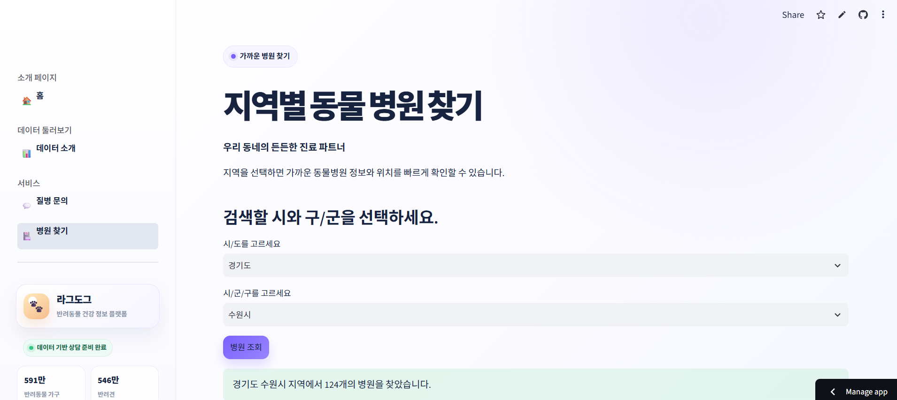
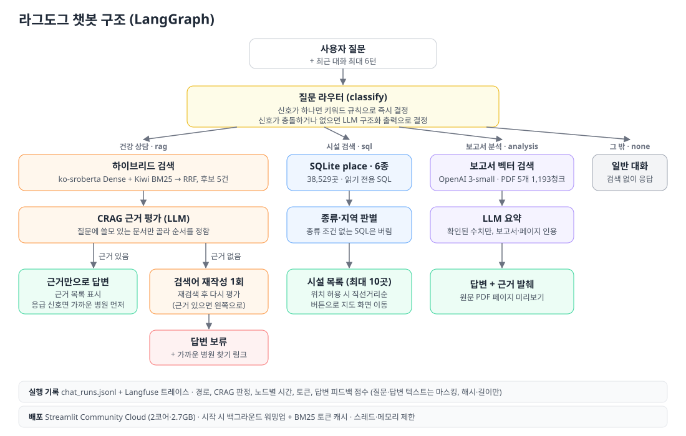
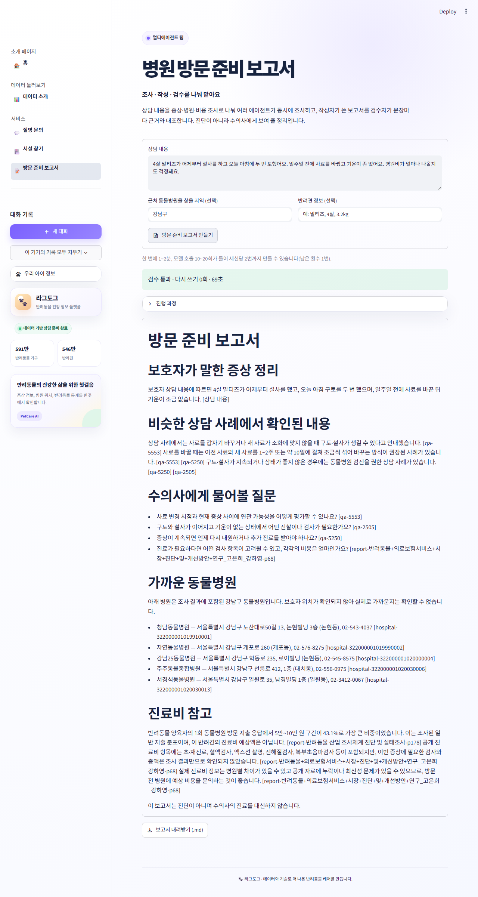

# 🐾 라그도그 (RagDog)

> 반려견 건강 상담, 반려동물 시설 검색(동물병원·약국·동반 시설 등 38,529곳), 반려동물 보고서 분석을 하나의 챗봇으로 제공하는 RAG 서비스입니다. 근거가 없으면 지어내지 않고 답변을 보류합니다.

- **배포 앱:** <https://dograg-n4gxibufynkgiuixfrkx2v.streamlit.app/rag>
- **설계 기록(위키):** [`docs/wiki/`](docs/wiki/README.md). 실험 수치, 채택·기각 이유, 미해결 과제를 모았습니다.
- 프로젝트 노션: <https://app.notion.com/p/3b5fceb573c380ea8488c7936f77f6d5>
- 발표 당시 버전: <https://mle-01-p1-team2-f5fqyncuwejycn4hyrp64b.streamlit.app/rag> (`encore-ai-campus/mle-01-p1-team2`, 아래 개선 이전)

> 엔코아 AI 캠퍼스 4인 팀 프로젝트(2026-08)를 발표 이후(2026-09~10) 오현탁이 측정하며 개선했습니다.
>
> 의료 판단이나 응급 처치를 대신하지 않습니다. 위급하거나 증상이 지속·악화되면 동물병원에 문의해야 합니다.

## 1분 요약

**무엇을 하나:** 반려견 보호자의 질문 하나로
- **건강 상담:** AI Hub 상담 19,206건에서 비슷한 사례를 찾아 근거로 답하고, 근거가 없으면 지어내지 않고 **보류**합니다.
- **시설 찾기:** 동물병원·약국·동반 시설 등 6종 38,529곳을 SQL로 정확히 찾습니다. 응급 표현이 있으면 가까운 병원 전화번호를 먼저 보여 줍니다.
- **보고서 분석:** 반려동물 보고서 5종을 쪽수와 함께 인용해 요약합니다.
- **방문 준비 보고서:** 멀티에이전트 팀(계획 → 병렬 조사 → 작성 → 검수)이 수의사에게 보여 줄 보고서를 만듭니다.

**핵심 지표** (모두 같은 평가 세트로 전후 비교)

| | 이전 | 이후 |
| --- | ---: | ---: |
| 건강 검색: 쓸모 있는 문서가 상위 3건에 있는 질문 (100문항, 후보마다 판정) | 0.46 | **0.72** |
| 근거 없는 질문에 답변 보류 / 답할 질문을 잘못 보류 (60문항) | 0/20 / – | **16/20 / 1/38** |
| 방문 준비 보고서 검수 통과율 / 중앙 시간 (상담 12개) | 0.70 / 68초 | **1.00 / 49초** |
| 최대 메모리 / 재시작 후 첫 답변 | 1,817MB / 약 165초 | **985MB / 약 8초** |

**측정으로 원인을 찾은 사례**
1. **필터가 검색을 망치고 있었다.** 앱 경로를 그대로 재현하니 적중률이 벤치마크(0.262)의 절반이었습니다. 질문에서 추론한 연령·진료과 필터가 기대는 말뭉치 라벨이 질문 본문과 34%·59%만 일치했습니다. 필터를 빼자 0.141 → 0.264. 라벨 대신 "질문에 쓸모 있는가"로 후보 2,357개를 판정한 새 기준에서도 0.46 → 0.72로 같은 결론이었습니다(같은 판정을 두 번 했을 때 일치율 86.5%). 계획했던 "질문 줄이기"는 같은 실험에서 효과가 없어(p=0.85) 넣지 않았습니다. [실험 8](docs/wiki/retrieval-experiments.md)
2. **에이전트 팀이 얻을 수 없는 정보를 계속 요청했다.** 실패한 상담 3건은 검수 전에 멈췄습니다. 작성자가 실시간 영업 여부처럼 도구에 없는 정보를 재조사로 두 번 요청하다 상한에 닿은 것이었습니다. 추가 조사를 한 번으로 제한하고(코드로 판정), 검수 모델을 가볍게 해 통과율 0.70 → 1.00, 시간 −32%. [팀 기록](docs/wiki/visit-prep-team.md)
3. **실패 처리가 배포 장애를 잡았다.** 재부팅 직후 보고서의 증상 조사가 모두 실패했지만, 앱은 멈추지 않고 "사람 확인 필요"를 남겼고 Langfuse 기록으로 바로 알아챘습니다. 원인(세션 없는 스레드에서 처음 로드되는 캐시)을 로컬에서 재현해 고쳤습니다.

**운영:** Langfuse 트레이싱(질문·답변은 보내기 전에 마스킹, 배포 버전·세션·태그로 구분), 매주 자동 회귀 평가(GitHub Actions), 8시간마다 잠자기 방지, PR마다 테스트 260여 개.

**기술:** LangGraph · LangChain · Chroma · `jhgan/ko-sroberta-multitask` · Kiwi + BM25 · OpenAI (`gpt-6-luna`, `text-embedding-3-small`) · SQLite · Langfuse · Streamlit Community Cloud · GitHub Actions

<details>
<summary>개선 지표 전체</summary>

| 개선 항목 | 이전 | 이후 | 측정 |
| --- | ---: | ---: | --- |
| 건강 검색 `hit@3` | 0.2264 | **0.2620** | 검증 Q&A 561건, Dense → Dense+BM25 하이브리드 |
| 건강 검색 쓸모 있는 문서 상위 3건 `useful@3` (앱 실제 경로, 실험 9) | 0.46 | **0.72** | 100문항, 후보 2,357개를 LLM이 판정. 라벨 일치 기준의 한계를 대신함 |
| 건강 검색 `hit@3` (앱 실제 경로) | 0.141 | **0.264** | 질문에서 추론한 연령·진료과 필터를 검색에서 뺌. 말뭉치 라벨이 질문 본문과 34%·59%만 일치 ([실험 8](docs/wiki/retrieval-experiments.md)) |
| 근거 없는 질문에 답변 보류 | 0/20 | **16/20** | 60문항 평가, CRAG 적용 |
| 답할 수 있는 질문의 과잉 보류 | – | **1/19** | 같은 평가 |
| 라우터 오분류 | 4/60 | **0/60** | 같은 평가 |
| 서버 재시작 후 첫 답변 대기 | 약 165초 | **약 8초** | 로컬, 페이지를 연 지 1분 뒤 질문 |
| 건강 답변 첫 글자까지 (p50) | 9.1초 | **6.0초** | 건강 40문항 질문별 비교, 근거 평가만 추론 끔 |
| 저장소의 벡터 DB 크기 | 681MB | **209MB** | `data/chroma_db/` |
| 최대 메모리 | 1,817MB | **985MB** | 로컬, Cloud 보장 690MB·최대 2.7GB |
| 시설 검색 데이터 | 병원 1종 5,448곳 | **6종 38,529곳** | 공공데이터 6종, 원본 111,998행 정제 |
| 시설 종류 판별 | – | **26/26** | 시설 검색 평가 36문항 |

`hit@3`는 검색 문서의 연령 단계·진료과·질병이 질문과 모두 일치하는 비율입니다. 의료적 정확도를 뜻하지 않습니다(이 라벨 자체의 한계는 실험 8 참고).

</details>

## 데모

배포 앱의 `rag` 페이지에서 바로 질문할 수 있습니다.

| 질문 예시 | 경로 | 동작 |
| --- | --- | --- |
| 강아지가 이틀째 설사를 해요 | 건강 상담 | 유사 상담 사례를 근거로 답하고 근거 목록을 보여 줌 |
| 햄스터가 해바라기 씨를 먹어도 되나요? | 건강 상담 | 강아지 상담 자료에 근거가 없어 **답변 보류** |
| 동작구 동물병원 알려줘 | 시설 검색 | SQLite에서 최대 10곳, 버튼으로 지도 이동 |
| 대형견도 들어갈 수 있는 애견동반 펜션 3곳만 추천해줘 | 시설 검색 | 동반 시설 중 크기 조건을 SQL로 걸러 3곳, 추가 요금·제한사항 표시 |
| (건강 답변 아래) 이 상담으로 방문 준비 보고서 만들기 | 멀티에이전트 팀 | 증상·병원·비용을 병렬 조사해 근거 번호(①②)가 달린 보고서, 내려받기 |
| 반려동물 장묘 서비스 이용 실태를 알려줘 | 보고서 분석 | 보고서 이름·페이지를 인용해 요약. 근거마다 2~3줄 미리보기, '자세히 보기'를 켜면 전문과 원문 PDF 페이지 |

근거가 없을 때의 실제 응답(배포 앱, 2026-10-05):

```text
검색된 상담 자료에서 이 질문에 답할 근거를 찾지 못해 답변을 드리지 않았습니다.
증상이 계속되거나 걱정되면 가까운 동물병원에 문의해 주세요.
[가까운 동물병원 찾기]
```

| 건강 상담과 검색 근거 | 보고서 분석 |
| --- | --- |
|  |  |

<details>
<summary>화면 더 보기 (홈, 대시보드, 병원 검색, 지도)</summary>





</details>

## 아키텍처



- 챗봇은 LangGraph `StateGraph`입니다(`src/chat_graph.py`). 질문 분류, 검색, 근거 평가, 재작성, 답변, 보류가 각각 노드입니다.
- 건강 상담만 CRAG를 거칩니다. 보고서 분석은 측정해 보니 CRAG가 오히려 정답 근거를 걸러 내서 적용하지 않았습니다(아래 결정 3).
- 시설 정보(병원·약국·동반 시설·미용·위탁·장묘)는 정확한 조건 검색이 중요하므로 벡터 검색 대신 SQLite 읽기 전용 조회를 씁니다. LLM이 쓴 SQL은 질문한 시설 종류 조건이 없으면 버리고 정해진 SQL을 씁니다.
- 질문에 응급 신호가 있으면 답변을 만들기 전에 가까운 동물병원(전화 링크 포함)을 먼저 보여 줍니다.
- 모든 실행은 Langfuse 트레이스로 남깁니다. 노드별 시간, 토큰, 답변 피드백 점수를 볼 수 있고, 질문·답변·근거 텍스트는 보내기 전에 마스킹합니다.

### 운영 모니터링 (Langfuse)


- 2026-10-07 하루치 화면입니다(배포 앱과 로컬 확인 실행 포함).
- **규모:** 트레이스 40건, observation 310건, `gpt-6-luna` 토큰 23.13K
- **지연:** 전체 실행 p50 0.01초, p90 8.45초입니다. 시설 검색처럼 LLM을 부르지 않는 질문은 거의 바로 끝나고, 건강·보고서 답변이 시간 대부분을 씁니다.
  - 건강 답변 노드 `health_simple`은 p90 10.24초입니다.
  - 근거 평가 `health_grade`는 p90 3.95초입니다.
- **피드백:** 👍/👎 점수 `user_feedback`가 2건 쌓였습니다.
- 질문·답변 원문은 대시보드 어디에도 없고, 해시·길이와 `[masked N chars]`만 보입니다. [모니터링 기록](docs/wiki/observability.md)
- **평가 실험:** CRAG 60문항과 시설 라우팅 36문항을 Langfuse 데이터셋으로 올렸습니다. 설정을 바꿀 때마다 실험으로 돌려 정확도·과잉 보류·지연(p50/p90)을 실행끼리 나란히 비교합니다. 예를 들어 근거 평가의 추론을 끄면 p90이 16.7초에서 10.6초로 줄고, 정확도는 0.90에서 0.88로 60문항 중 1문항 차이였습니다. 재현: `scripts/langfuse_experiments.py`
- **정기 회귀 평가:** GitHub Actions가 매주 월요일 같은 두 실험과 방문 준비 팀 상담 12개를 돌리고, 정확도·보류율·응답 시간·반복 의심 비율 중 하나라도 기준을 넘으면 실패로 알립니다. 결과 표는 작업 요약에 남습니다(`regression-eval.yml`, `scripts/check_regression.py`).

## 멀티에이전트 팀: 병원 방문 준비 보고서

보호자의 상담 내용(지역, 반려견 정보 포함)을 받아, 수의사에게 보여 줄 **방문 준비 보고서**를 만드는 에이전트 팀입니다(`team/`).
챗봇의 빠른 경로는 그대로 둡니다. 여러 출처를 모아 검수까지 해야 하는 이 작업에만 에이전트 팀을 씁니다. 짧은 질문은 지금 챗봇이 6초(건강) 또는 0.2초(시설)에 답하는데, 이를 에이전트 여러 개에 거치게 하면 느리고 비싸기만 하기 때문입니다.


### 팀 구성

| 에이전트 | 하는 일 | 허용 도구 |
| --- | --- | --- |
| `clarify` / `ask_guardian` | (앱에서만) 보고서에 꼭 필요한데 상담에 빠진 정보를 3개까지 묻고, `interrupt`로 멈춰 보호자의 답을 기다린다. 응급이면 묻지 않는다 | 없음(구조화 출력) / 없음 |
| `planner` 계획 | 상담을 조사 작업으로 나눈다. 작업 수는 상담마다 다르다: 증상마다 health 1개, 지역이 있으면 place, 비용이 걸리면 cost, 최대 5개 | 없음(구조화 출력) |
| `health_researcher` × N | 증상 하나의 비슷한 상담 사례를 찾고, 근거 평가로 쓸 것만 남긴다 | `search_health_qa`: 하이브리드 검색 + CRAG 근거 평가, AI Hub 19,206건 |
| `place_researcher` | 지역의 동물병원. 응급이면 이름에 24시·응급·야간이 들어간 곳을 먼저 | `find_hospitals`: 공공데이터 시설 DB 읽기 전용 |
| `cost_researcher` | 진료비·보험 통계 | `search_report_stats`: 보고서 5종 벡터 검색 |
| `writer` 작성자 | 조사 결과만으로 보고서를 쓰고, 다음 담당을 스스로 정한다(핸드오프) | `write_report`, `request_review`, `request_research` |
| `reviewer` 검수자 | 보고서의 주장을 하나씩 상담 내용·조사 결과와 대조한다. 근거 없는 주장이 하나라도 있으면 반려 | 없음(충실도 판정 모듈 `src/faithfulness.py`) |
| `supervisor` | 반려되면 다시 쓰기와 다시 조사 중에서 고른다. 돌려보낸 횟수가 2회에 닿으면 "사람 확인 필요"로 끝낸다 | 없음(구조화 출력) |
| `publisher` | 결과 파일 저장. 상한에 닿은 보고서는 맨 위에 경고를 붙인다 | 없음 |

- **도구 권한은 코드로 강제합니다(`team/agents/workers.py`).** 조사원은 작업 종류의 도구 하나만 받고, 작성자는 검색 도구를 받지 않습니다. 조사원의 도구 호출은 3회, 모델 호출은 6회로 제한합니다.

### 역할을 나눈 이유

- **근거 출처가 셋이고 다루는 방식이 다릅니다.** 상담 사례는 의미 검색과 근거 평가, 병원은 정확한 주소 조건 조회, 비용은 연구 보고서 검색입니다. 조사원 하나에 도구를 모두 주면 증상 조사에서 병원 DB를 뒤지는 식으로 엉뚱한 도구를 고를 수 있습니다.
- **작성자에게 검색 도구를 주지 않습니다.** 그래야 근거 없이 쓴 문장이 검수에서 걸립니다. 정보가 모자라면 작성자가 직접 검색하지 않고 `request_research`로 슈퍼바이저에게 알립니다. 추가 조사도 반복 상한 안에서만 일어납니다.
- **검수는 작성자와 분리했습니다.** 작성자가 스스로 점검하면 자기 글에 관대해집니다. 검수자는 문장마다 근거를 대조하는 별도 판정을 씁니다.
- **의료 정보라서 끝없이 고치지 않습니다.** 두 번 돌려보내도 근거를 못 찾으면 사람(수의사)에게 넘깁니다. 진단하지 않고 근거가 없으면 보류한다는 챗봇의 원칙과 같습니다.

### 과제 요구사항 대응

| 요구사항 | 구현 |
| --- | --- |
| 역할이 다른 에이전트 3개 이상, 필요한 도구만 | 조사원 3종 + 작성자, 각자 다른 도구. 테스트 `tests/test_visit_team.py`가 권한을 확인 |
| 슈퍼바이저 또는 핸드오프 | `supervisor`(반려 뒤 다시 쓰기/다시 조사 결정) + 작성자의 `request_review`·`request_research` 핸드오프(`Command.PARENT`) |
| `Send` 병렬 실행과 리듀서 | `team/graph/edges.py`의 `dispatch`가 작업마다 `Send`. `merge_findings` 리듀서가 작업 번호별로 합침 |
| 검수와 반복 상한 | `reviewer` + `MAX_ROUNDS = 2`. 닿으면 "반복 상한 도달: 수의사(사람) 확인 필요" |
| 결과 파일 저장 | `output/visit_prep/<시각>/visit_report.md`, `result.json`(상태, 판정, 반복 횟수, 계획, 근거 id) |

### 실행 방법

```bash
uv sync
cp .env.example .env    # OPENAI_API_KEY (Langfuse 키는 선택)
uv run python -m team.main "4살 말티즈가 어제부터 설사를 하고 오늘 아침에 두 번 토했어요. 병원비도 걱정돼요." --region 강남구 --profile "말티즈, 4살, 3.2kg"
```

### 실행 결과 (2026-10-07, 실제 모델 호출)

| 상담 | 흐름 | 결과 | 시간 |
| --- | --- | --- | ---: |
| [말티즈 설사·구토 + 진료비](docs/visit_prep_examples/normal/visit_report.md) | 조사 5개 병렬(health 3, place, cost) → 검수 반려(근거 없는 주장 2개) → 다시 쓰기 → 통과 | 검수 통과, 반복 1회, 주장 20개 모두 근거 확인 | 116초 |
| [푸들 경련(응급)](docs/visit_prep_examples/urgent/visit_report.md) | 조사 2개 병렬 → 맨 위에 "지금 바로 병원에 연락하세요", 24시 병원 먼저 | 검수 통과, 주장 24개 모두 근거 확인 | 62초 |
| [고양이 식욕 부진(대상 밖)](docs/visit_prep_examples/out_of_scope/visit_report.md) | 반려견 자료에 근거가 없음 → 작성자가 추가 조사 요청 2회 → 반복 상한 | **수의사(사람) 확인 필요** | 53초 |

- **대상 밖 질문:** 고양이 질문은 4번 실행해 3번이 반복 상한에서 멈췄습니다. 나머지 1번은 "근거를 찾지 못했다"고만 쓴 보고서로 통과했습니다. 지어낸 답은 한 번도 없었습니다.
- **메모리:** 세 상담을 차례로 실행한 프로세스의 최대 메모리는 1,218MB였습니다(로컬, 단독 프로세스).

### 앱에서 실행: "방문 준비 보고서" 페이지



- 질병 문의에서 한 마지막 질문이 상담 내용 칸에 미리 들어가고, 저장한 반려견 정보도 채워집니다. 진행 단계(계획 → 조사 → 작성 → 검수)가 실시간으로 보이고, 결과는 마크다운으로 내려받을 수 있습니다.
- **보호자에게 되묻기(day51 interrupt):** 상담에 증상 시작 시점·횟수·나이처럼 보고서에 필요한 정보가 빠져 있으면, 팀이 계획 전에 멈추고 질문을 3개까지 보여 줍니다. 답하거나 건너뛰면 같은 실행이 멈춘 자리에서 이어집니다(같은 `thread_id`, `Command(resume=답변)`). 답변은 상담 내용에 더해져 계획·검수의 근거가 됩니다. 응급 상담은 묻지 않고 바로 만듭니다. 상담 12개에서 8개가 질문을 받았고 응급 4개는 0개였습니다.
- **근거 표기:** 작성자와 검수자는 근거 ID(`[qa-17403]`, `[hospital-3230…]`)로 일하고, 화면과 내려받는 파일에서는 ①②… 번호로 바꾸고 끝에 근거 목록(상담 사례, 병원 공공데이터, 보고서 쪽수)을 붙입니다(`team/core/citations.py`). CLI가 저장하는 `visit_report.md`는 검수 기록을 위해 원래 ID를 그대로 둡니다.
- **실행 제한:** 한 번에 모델 호출 10~20회, 1~2분이 들어 세션당 2번까지 만들 수 있습니다. 서버 전체에서 한 번에 하나만 돌고, 다른 실행 중이면 잠시 뒤에 다시 누르라고 안내합니다. 응급 징후가 보이면 보고서보다 먼저 병원 연락을 안내합니다.
- **개인정보:** 실행 파일은 임시 폴더에 쓰고 끝나면 지웁니다. 보고서는 그 세션에만 남습니다(챗봇과 같은 원칙).
- **메모리(Streamlit 서버 안, 로컬):** 질병 문의 페이지 워밍업 뒤 893MB → 보고서 1회 실행 중 최대 1,080MB(+187MB), 두 번 측정이 같았습니다(`scripts/measure_visit_prep_memory.py`). 배포 한도(2.7GB) 안이고 한 번에 하나만 돌므로 겹쳐 늘지 않습니다.

### 평가와 실패 처리 (요약)

- **평가:** 상담 12개(반려견 10, 고양이·토끼 2)를 Langfuse 데이터셋으로 돌립니다. 검수 통과율 0.70 → **1.00**, 사람 확인으로 끝난 비율 0.42 → **0**, 응급 판정 4/4, 병원 목록 9/9, 시간 p50 68 → **49초**.
- **실패 처리(day56):** 병렬 조사 하나가 실패해도 기록하고 계속합니다. 진료비 조사가 실패하거나 근거가 없으면 그 절을 비우지 않고 정해 둔 기본 안내(전화로 비용 확인, 진료비 게시제)로 채웁니다. 필수인 증상 조사가 모두 실패하면 쓰지 않고 "사람 확인 필요"로 멈춥니다. 재시도는 OpenAI SDK 한 계층에만 두고, 같은 지적이 반복되면 일찍 멈춥니다. 장애 주입 실험과 실제 배포 장애 사례 포함.
- **노드 방문 횟수(day56):** 실행마다 노드별 방문 횟수를 기록하고, 정상 실행보다 많이 돈 워커가 있으면 "반복 의심"으로 셉니다. 매주 회귀 평가가 이 비율을 감시합니다(현재 2/12).
- 전체 수치, 원인 분석, 고친 것: [docs/wiki/visit-prep-team.md](docs/wiki/visit-prep-team.md)

## 기술적 결정 5가지

### 1. 검색: Dense만 쓰다가 Dense + BM25 하이브리드로

- **문제:** 기존 Dense 검색의 `hit@3`는 0.2264였습니다. 키워드만 쓰는 BM25를 따로 측정하자 0.2531로 오히려 높았습니다. 이 데이터에서는 질병명·증상명 같은 명사 일치가 중요하다는 뜻입니다.
- **선택:** Kiwi 형태소 분석으로 명사·외국어·숫자만 뽑아 BM25 색인을 만들었습니다. Dense 후보 12건과 BM25 후보 12건을 RRF(c=60)로 합칩니다.
- **결과:** 검증 Q&A 561건에서 `hit@3`가 0.2264에서 0.2620으로 올랐고, 미적중은 434건에서 414건으로 줄었습니다.
- **대가:** 검색 지연이 약 4배(평균 171ms → 704ms, 로컬)로 늘었습니다.
- **기각한 대안:**
  - 문자 n-gram 재정렬: `hit@3` 0.2228로 개선이 없었습니다.
  - RRF 가중치 조정: 튜닝셋에서 고르고 홀드아웃에서 검증했지만 개선이 없었습니다.
  - [실험 기록](docs/wiki/retrieval-experiments.md)

### 2. 임베딩은 데이터마다 따로 고른다

- **문제:** 메모리를 줄이려고 건강 Q&A 임베딩도 OpenAI로 바꾸는 방안을 검토했습니다.
- **측정:** 같은 벤치마크에서 하이브리드 `hit@3`가 0.2674에서 0.2353으로 떨어졌습니다. BM25 단독(0.2496)보다도 낮았습니다.
- **결정:** 구어체 짧은 질문인 건강 Q&A는 한국어 모델 ko-sroberta를 유지합니다. 표와 수치가 많은 긴 보고서 PDF 5종(1,193청크)은 OpenAI `text-embedding-3-small`로 임베딩합니다.
- **함께 고친 것:** 보고서 검색어 앞에 KB 목차 항목 전체가 붙던 버그를 측정으로 찾았습니다. 고친 뒤 정답 페이지가 상위 6건에 들어가는 질문이 7/18에서 12/18로 늘었습니다.

### 3. CRAG: 지어내는 대신 근거를 평가하고 보류한다

- **문제:** 검색은 항상 무언가를 돌려줍니다. 그래서 햄스터 질문에도 강아지 상담 3건이 "검색 근거"로 화면에 나왔습니다.
- **선택:** LLM이 후보 5건 중 질문에 실제로 쓸모 있는 문서만 고릅니다. 하나도 없으면 검색어를 1번 고쳐 다시 찾고, 그래도 없으면 답변을 보류하고 병원 찾기 링크를 보여 줍니다. 출처를 검증할 수 없는 웹 검색 보완은 의료 정보라서 넣지 않았습니다.
- **v1 → v2:** 첫 버전은 판정이 너무 엄격하고 호출이 많았습니다. 판정 기준을 완화하고, 근거가 하나도 없을 때만 재작성하고, 판정에 넘기는 후보와 발췌 길이를 줄였습니다.

| 60문항 평가 (실제 모델) | CRAG 꺼짐 | v1 | **v2 (현재)** |
| --- | ---: | ---: | ---: |
| 근거 없는 건강 질문 20개 중 보류 | 0 | 16 | **16** |
| 답할 수 있는 건강 질문의 과잉 보류 | 0 | 3/17 | **1/19** |
| 토큰 (꺼짐 대비) | 1배 | 3.9배 | **2.0배** |
| 평균 지연 | 14.7초 | 22.7초 | 19.6초 |

- **보고서에는 끔:** 보고서 질문 18개에 CRAG를 켜면 정답 페이지가 근거에 포함되는 질문이 12개에서 10개로 줄었습니다. 표와 수치가 많은 청크를 LLM이 잘못 걸러 냈기 때문입니다. 설정을 `ENABLE_CRAG`(건강)와 `ENABLE_CRAG_REPORTS`(보고서, 기본 꺼짐)로 나눴습니다.
- **보류 안내(day53):** 보류할 때 찾아본 것(후보 수, 재검색 횟수), 확인하지 못한 것(근거 평가 모델의 설명을 그대로, 추가 호출 없음), 다시 물어볼 방법을 함께 보여 줍니다. 보류한 15문항 모두에 들어갔습니다.
- **긴 대화(day52):** 최근 6턴은 원문, 그보다 오래된 대화는 누적 요약으로 넣습니다(질문 3개마다 요약 1회). 첫 턴에 말한 지병을 10턴 뒤 질문에 반영한 답변이 0~1/6 → 6/6이 되었습니다. [기록](docs/wiki/safety-and-evidence.md)
- 실행마다 경로, 판정, 재작성 횟수, 토큰 사용량을 `output/chat_runs.jsonl`에 기록합니다. 질문 원문은 저장하지 않고 해시와 길이만 남깁니다.
- 같은 기록을 Langfuse 트레이스로도 보냅니다. 그래프 노드별 시간, 모델 호출별 토큰·비용, 세션별 묶음을 대시보드에서 봅니다. 답변마다 👍/👎를 누르면 그 트레이스에 점수로 붙습니다. 질문·답변·근거 본문은 SDK의 마스킹 훅이 `[masked N chars]`로 바꿔서 보내고, 보낼 span에 텍스트가 없는지 테스트와 실제 API 조회로 확인했습니다. [모니터링 기록](docs/wiki/observability.md)
- [평가 기록](docs/wiki/safety-and-evidence.md), 재현: `uv run python scripts/evaluate_crag.py --crag on|off`

### 4. 라우터: 확실한 건 규칙으로, 애매한 건 LLM으로

- **문제:** 키워드 규칙은 빠르지만(중앙값 0.04ms), 고정된 우선순위로 충돌을 처리했습니다. 예를 들어 "닭 뼈를 삼켰는데 가까운 동물병원에 갈 수 없어요"는 건강 질문인데 병원 검색으로 갔습니다. 평가 60문항 중 4개가 이렇게 잘못 분류됐습니다.
- **선택:** 건강·병원·보고서 신호가 **하나뿐일 때만** 규칙으로 결정합니다. 신호가 충돌하거나 없으면 LLM 구조화 출력으로 결정합니다. API 키가 없으면 예전 우선순위로 동작합니다.
- **결과:** 오분류 4건이 모두 바로잡혔고 새로 틀린 질문은 없었습니다. LLM까지 간 질문은 60개 중 13개입니다. [라우터 기록](docs/wiki/router.md)
- **시설 검색 평가:** 시설 종류가 6가지로 늘어 36문항 평가 세트를 따로 만들었습니다. 종류 판별 26/26, LLM 라우터까지 쓴 라우팅 36/36입니다. API 키 없이 규칙만 쓴 라우팅은 34/36이었는데, 놓친 표현("토했", "먹여도")을 키워드에 넣어 36/36이 됐습니다. "미용 후 피부가 빨개져요"처럼 시설 단어가 들어간 건강 질문도 평가에 넣었습니다.

### 5. 무료 배포 환경(최대 2코어, 메모리 보장 690MB)에 맞추기

- **첫 답변 지연:** 원인을 재 보니 서버를 다시 시작한 뒤 첫 질문에서 19,206개 문서를 Kiwi로 토큰화하느라 약 130초가 걸렸습니다. 토큰화 결과를 캐시 파일로 저장했습니다. 캐시 키는 코퍼스 해시와 토크나이저 버전입니다. 여기에 페이지를 열면 모델과 색인을 백그라운드에서 미리 불러오도록 했습니다. 로컬 기준으로 첫 답변까지 약 165초에서 약 8초로 줄었습니다. 검증 질문 200개에서 BM25 상위 12건 결과는 모두 같았습니다.
- **저장소 크기:** Chroma가 문자열 메타데이터를 색인하면서 답변 원문이 DB를 크게 부풀렸습니다. 답변은 CSV에서 문서 ID로 읽도록 바꾸고 쓰지 않는 컬렉션을 정리했습니다. DB가 681MB에서 209MB로 줄었습니다.
- **메모리 초과 경고:** Streamlit에서 메모리 초과 메일을 받았습니다. 단계별로 측정해 보니 Kiwi 하나가 약 480MB였습니다.
  - 다어절 사전을 끄자 Kiwi가 294MB로 줄었고, 검색 `hit@3`는 그대로였습니다.
  - torch 스레드 수와 glibc malloc arena 수도 2개로 제한했습니다.
  - 질문 임베딩을 PyTorch에서 모델 저장소가 제공하는 ONNX int8 파일로 바꾸고, 앱에서 torch를 아예 불러오지 않게 했습니다. torch를 불러온 건 모델만이 아니었습니다. langchain_core도 선택 기능인 토크나이저 때문에 transformers와 torch를 불러오고 있었습니다.
  - 검증 561문항의 `hit@3`는 0.2620에서 0.2638로 같은 수준이고, 최대 메모리는 1,587MB에서 985MB로 줄었습니다.
  - [자원 기록](docs/wiki/deployment-resources.md)

## 기능 상세

| 도구 | 선택되는 질문 | 동작 | 결과·제한 |
| --- | --- | --- | --- |
| 건강 상담 | 증상, 질병, 치료, 건강 정보 | 하이브리드 검색 → CRAG 근거 평가 → 근거만으로 답변 | 근거 1~5건 표시. 연령 단계·진료과·질병 필터. 호흡곤란·발작·독성물질 섭취 같은 표현에는 진료 권고를 따로 표시 |
| 시설 검색 | 동물병원·동물약국·동반 가능 시설·미용·위탁·장묘업체의 이름, 주소, 지역, 목록, 이용 조건 | SQLite `place` 읽기 전용 조회. LLM이 만든 SQL은 질문한 종류(`kind`) 조건이 없으면 버리고 정해진 SQL을 씀. 위치를 허용하면 직선거리순 정렬 | 최대 10곳("3곳만" 반영). 위치 없이 "가까운 곳"을 물으면 임의의 장소를 가장 가깝다고 표시하지 않고 위치 사용이나 지역 검색을 안내. 좌표가 없는 미용·위탁·장묘는 지역 검색만 |
| 보고서 분석 | 반려동물 현황, 통계, 추이, 비교 | 보고서 컬렉션에서 6건 검색 → 확인된 수치만 요약 | 보고서 이름·페이지 인용. 근거는 2~3줄 미리보기로 접어 두고 '자세히 보기'를 켤 때만 전문과 PDF 페이지를 그림(보지 않는 페이지는 렌더링하지 않음). 근거가 없으면 모델을 호출하지 않음 |
| 일반 대화 | 인사, 기능 문의, 날짜 | 검색 없이 짧게 응답 | |

- **위치 정보:** 버튼을 누를 때만 브라우저 권한을 요청합니다. 좌표는 현재 세션의 계산에만 쓰고 DB·파일·대화 기록에 남기지 않습니다. 거리는 직선거리이고 이동 시간이나 영업 여부는 뜻하지 않습니다.
- **API 키가 없으면:** 건강 상담은 검색 결과까지만 보여 줍니다. 보고서 분석은 질문 임베딩에도 OpenAI가 필요해서 동작하지 않습니다. 지역 키워드가 있는 병원 검색은 키 없이 동작합니다.

## 데이터

| 데이터 | 경로 | 규모 | 용도 |
| --- | --- | ---: | --- |
| 반려견 건강 Q&A | `data/df.csv` | 19,206건 | 건강 상담 원천. 연령 단계·진료과·질병 메타데이터 |
| 검증 Q&A | `data/df_val.csv` | 561건 | 검색 평가 |
| 반려동물 시설 | `data/places.db` | 6종 38,529곳 | 병원 5,459 · 약국 13,692 · 동반 시설 2,318 · 미용 11,075 · 위탁 5,897 · 장묘 88. 원본 111,998행을 정제 ([정제 기록](docs/wiki/places-data.md)) |
| 반려동물 보고서 | `data/source/*.pdf` | 5개, 922페이지, 1,193청크 | KB 2025 반려동물 보고서, 반려동물 복지실태와 개선과제, 반려동물 산업 조사체계 진단 및 실태조사, 반려동물 의료보험서비스 시장 진단, 반려동물 장묘서비스 이용 실태조사 |
| 벡터 저장소 | `data/chroma_db/` | 209MB (Git LFS) | 건강 `pet_care`(ko-sroberta, 768차원), 보고서 `pet_reports_openai3small_1536_…` |
| 평가 문항 | `tests/data/crag_eval_questions.json` | 60문항 | 건강 답변 가능 20, 건강 근거 없음 20, 보고서 답변 가능 18(정답 페이지 지정), 보고서 근거 없음 2 |

출처는 AI Hub 반려견 성장·질병 말뭉치, KB경영연구소 2025 반려동물 보고서와 공공 연구 보고서, 공공데이터포털(행정안전부 동물병원·동물약국), 국가동물보호정보시스템(미용·위탁·장묘업), 한국문화정보원(반려동물 동반 가능 시설) 데이터입니다. 문화시설 데이터의 약국 46,105행이 실제로는 8,443곳(평균 5.5번 중복)이라는 점을 확인하고, 의료·서비스 분류는 공식 인허가 데이터로 대신했습니다. `scripts/audit_health_data.py`로 데이터 품질을 점검했습니다. 학습 데이터의 질병 라벨 중 `기타`가 76.9%이며, 원본 라벨은 임의로 바꾸지 않았습니다.

## 프로젝트 구조

```text
.
├── main.py                 # Streamlit 진입점, 스레드·메모리 제한
├── app_pages/
│   ├── rag.py              # 챗봇 화면, 라우터, 검색·답변 도구
│   ├── hospital.py         # 시설 찾기: 종류·지역·현재 위치로 목록과 지도
│   ├── data.py             # 데이터 대시보드
│   ├── visit_prep.py       # 방문 준비 보고서: 멀티에이전트 팀 실행(세션당 2회, 서버 1개씩)
│   └── home.py
├── src/
│   ├── chat_graph.py       # LangGraph 그래프 (라우팅, CRAG, 보류)
│   ├── crag.py             # 근거 평가·재작성·질문 분해 프롬프트와 헬퍼
│   ├── hybrid_retrieval.py # BM25 색인, RRF, 토큰 캐시
│   ├── run_log.py          # 실행 로그 (질문 해시, 토큰 사용량)
│   ├── tracing.py          # Langfuse 트레이싱 (텍스트 마스킹)
│   ├── health_safety.py    # 응급 표현 안내
│   └── ...
├── team/                   # 멀티에이전트 팀: 병원 방문 준비 보고서 (core → tools → agents → graph → main)
├── scripts/                # 평가(하이브리드, RRF 가중치, CRAG), 메모리 측정, 캐시 생성
├── tests/                  # 단위·회귀 테스트, 평가 문항
├── docs/wiki/              # 실험 수치와 설계 결정 기록
└── data/                   # CSV, SQLite, PDF, Chroma
```

## 실행 방법

Python 3.12 이상과 [uv](https://docs.astral.sh/uv/)가 필요합니다.

```bash
uv sync
```

`.streamlit/secrets.toml`(또는 `.env`)에 키를 넣습니다. 이 파일은 Git에 올리지 않습니다.

```toml
OPENAI_API_KEY = "..."
ENABLE_CRAG = "true"   # 건강 상담 CRAG (선택)
```

```bash
uv run streamlit run main.py
```

테스트와 평가:

```bash
uv run python -m unittest discover -s tests
```

```bash
uv run python scripts/evaluate_hybrid_search.py
```

```bash
uv run python scripts/evaluate_crag.py --crag on
```

```bash
uv run python scripts/measure_memory.py
```

- 단위 테스트는 외부 API를 호출하지 않습니다.
- `evaluate_crag.py`는 실제 모델을 호출하므로 비용이 듭니다.
- GitHub Actions(`.github/workflows/streamlit-ci.yml`)가 PR과 `main` push마다 테스트를 실행합니다.
- Streamlit Community Cloud는 `main` 브랜치 변경을 감지해 자동으로 다시 배포합니다.

## 한계와 다음 단계

- **평가 지표의 한계:** 검색 적중(`hit@3`)의 정답은 말뭉치 라벨 일치인데, 그 라벨이 질문 본문과 34%·59%만 맞습니다(실험 8). 그래서 100문항의 후보 2,357개를 LLM으로 판정한 `useful@3`를 새 주 지표로 만들었습니다(같은 판정 두 번 일치율 86.5%, κ 0.79). 사람 검수는 아직 하지 않았습니다(실험 9). CRAG 평가는 직접 만든 60문항이고, 수의사 검토 같은 의료적 정확도 평가는 하지 않았습니다.
- **답변 충실도:** 답변을 주장 단위로 나눠 근거와 대조합니다. 보고서 답변 0.95, 건강 답변 약 0.8입니다. 건강 프롬프트에 "검사·약·시기는 근거에 있을 때만" 규칙을 넣은 뒤 근거 밖 의학 사실은 0개가 됐고, 대신 "자료에 없다"는 안내가 늘었습니다. [평가 기록](docs/wiki/safety-and-evidence.md)
- **검색 순서의 한계:** 새 기준(실험 9)으로 보면 후보 안에 쓸모 있는 문서가 있는 질문은 99%인데, 상위 3개에 들어오는 질문은 72%입니다. 배포 환경에서 돌릴 수 있는 ONNX 리랭커 3종을 재 봤지만, 쓸 수 있는 라이선스의 두 모델은 오히려 나빴고(0.69·0.45), 유일하게 나은 모델(0.76)은 답변마다 8초·0.5GB가 더 들고 비상업 라이선스라 넣지 않았습니다(실험 11).
- **보고서 답변:** 정답 페이지가 검색 상위 6개에 드는 질문이 18개 중 12개라, 페이지 전체로 넓히기(실험 10)도 필요한 문장만 뽑는 컨텍스트 압축(실험 12, 23→24·25/36, 차이 유의하지 않음, +1.5초)도 정답을 늘리지 못했습니다. 다음은 보고서 검색 자체입니다.
- **CRAG 비용:** 건강 상담에서 토큰이 2배, 지연이 약 5초 늘고, 과잉 보류가 1건(배뇨 이상 질문) 남아 있습니다.
- **배포 환경:** 잠자기는 8시간마다 헤드리스 브라우저 방문으로 막지만(`keep-alive.yml`), 코드 병합 뒤 재부팅 첫 실행의 모델·색인 로딩(약 80초)은 그대로입니다.
- **시설 데이터:** 인허가 기준이라 실제 영업 여부·영업시간은 알 수 없습니다. 동반 시설 정보의 90%는 2022년 작성분이고, 미용·위탁·장묘업체는 좌표가 없어 지역 검색만 됩니다.
- 미해결 과제 전체: [`docs/wiki/open-questions.md`](docs/wiki/open-questions.md)

## 팀과 역할

**팀 프로젝트 (2026-08, 4인)**
- 백관민: 팀장, RAG·청킹·임베딩·검색·평가
- 오현탁: RAG·청킹·임베딩·검색·평가
- 봉기람: 데이터 수집·전처리·EDA
- 차성종: Streamlit UI·시각화·배포

**발표 이후 개선 (2026-09~10, 오현탁)**

이 저장소(`rndigkwk/dograg`)에서 한 작업입니다. 위의 결정 1~5와 아래 작업이 여기에 해당합니다.
- 하이브리드 검색 도입과 오프라인 검색 실험 6건
- 위치 기반 병원 검색
- LangGraph 전환, CRAG v1·v2 설계와 평가
- 라우터 충돌 처리
- 보고서 5종 확장과 OpenAI 임베딩 적용
- 저장소·메모리·첫 답변 지연 최적화
- CI 수정과 설계 위키 작성
- 시설 데이터 6종 확장(공공데이터 111,998행 정제)과 응급 바로가기
- Langfuse 트레이싱(마스킹), 데이터셋·실험, 주간 회귀 평가 자동화
- 멀티에이전트 방문 준비 보고서 팀과 실패 처리
- 검색 필터 문제 발견(적중률 0.141 → 0.264)

자세한 변경 내역은 [`docs/changes-from-backup.md`](docs/changes-from-backup.md)에 있습니다.
