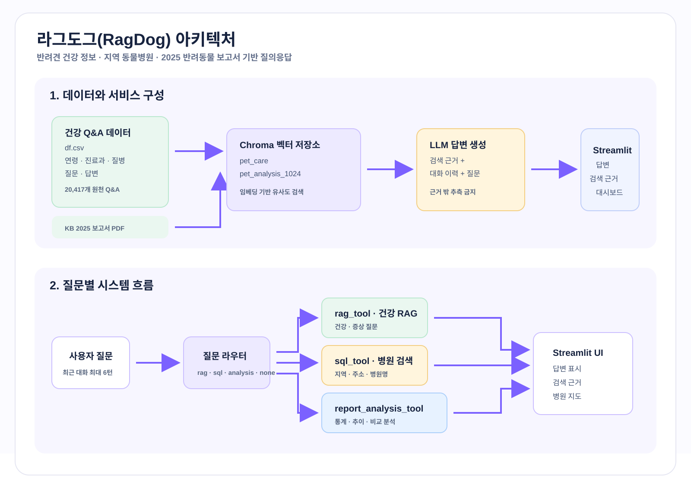

# 🐾 라그도그 (RagDog)

> 반려견 건강 Q&A, 지역 동물병원 검색, 반려동물 보고서 분석을 한곳에서 제공하는 데이터 기반 Streamlit 서비스입니다.

배포 주소: <https://mle-01-p1-team2-f5fqyncuwejycn4hyrp64b.streamlit.app/rag>
프로젝트 노션: <https://app.notion.com/p/3b5fceb573c380ea8488c7936f77f6d5>

## 프로젝트 목표

- 반려견 건강 질문에 학습 데이터 근거를 바탕으로 답변
- 질문 성격에 맞는 RAG, SQLite, 보고서 분석 도구 자동 선택
- 지역·이름·주소 기반 동물병원 정보 제공
- 데이터 분포와 RAG 평가 결과를 확인할 수 있는 대시보드 제공

> 의료 판단이나 응급 처치의 대체 수단이 아닙니다. 위급하거나 증상이 지속·악화되면 동물병원에 문의해야 합니다.

## 주요 기능

| 기능 | 제공 내용 | 근거 데이터 |
| --- | --- | --- |
| 반려견 건강 상담 | 증상·질병·치료 관련 질문에 검색 근거와 함께 답변 | 반려견 성장·질병 Q&A Chroma 컬렉션 |
| 동물병원 검색 | 지역, 주소, 병원명으로 병원 목록·주소를 조회하고 지도 페이지로 이동 | SQLite `hospital` 테이블 |
| 2025 반려동물 보고서 분석 | 현황, 양육, 지출, 비만, 펫로스 등의 통계·추이·비교를 요약 | KB 2025 반려동물 보고서 PDF Chroma 컬렉션 |
| 데이터 대시보드 | 질병, 진료과, 지역별 동물병원 분포 시각화 | 건강 Q&A·동물병원 CSV |

## 프로젝트 아키텍처와 시스템 흐름



아키텍처는 두 가지 검색 기반을 결합합니다. 건강 Q&A와 KB 보고서는 각각 Chroma 컬렉션에 저장되어 유사도 검색을 수행하고, 검색된 근거·필터·최근 대화를 LLM에 전달해 답변을 만듭니다. 반면 동물병원 정보는 벡터 검색이 아닌 SQLite `hospital` 테이블의 읽기 전용 SQL 조회를 사용하므로, 지역·주소·병원명 조건을 정확하게 처리합니다.

시스템 흐름은 사용자 질문과 최근 대화 최대 6턴에서 시작합니다. 질문 라우터는 건강·증상 질문을 `rag_tool`로, 지역·주소·병원명 질문을 `sql_tool`로, 통계·추이·비교 등의 보고서 질문을 `report_analysis_tool`로 각각 분기합니다. 일반 대화나 서비스 범위 밖 질문은 검색 도구를 호출하지 않습니다. 세 도구의 결과는 모두 Streamlit UI에서 답변으로 표시되며, 건강 RAG는 사용한 검색 근거도 함께 확인할 수 있습니다.

## RAG 도구 설명

`pages/rag.py`는 질문을 `rag`, `sql`, `analysis`, `none`으로 분류하고 아래 도구를 실행합니다. 인사말·기능 문의처럼 검색이 필요 없는 질문은 도구 없이 짧게 응답합니다.

| 도구 | 선택되는 질문 | 동작 | 결과·제한 |
| --- | --- | --- | --- |
| `rag_tool` | 반려견 증상, 질병, 치료, 건강 정보 | `pet_care` 컬렉션에서 유사 Q&A를 검색하고, 검색 문서만 근거로 LLM 답변 생성 | 기본 3건, 화면에서 1~5건 선택 가능. 연령 단계·진료과·질병 필터를 적용할 수 있으며 검색 근거를 화면에 표시 |
| `sql_tool` | 동물병원 이름, 주소, 지역, 병원 목록 | SQLite의 `hospital` 테이블을 읽기 전용 SQL로 검색 | 결과는 기본 최대 10곳, “하나만”·“가까운” 요청은 1곳으로 제한. 실제 거리 계산·진료 가능 여부 확인은 제공하지 않음 |
| `report_analysis_tool` | 2025 반려동물 보고서의 현황, 통계, 추이, 비교, 비중, 분포 | 보고서 전용 컬렉션에서 관련 페이지 6개를 검색해 요약·분석 | 답변에 없는 수치나 원인은 추측하지 않고, 검색 자료가 부족하면 부족함을 안내 |

### 건강 RAG 상세

1. 현재 질문과 최근 사용자 질문을 합쳐 후속 질문의 검색어를 보강합니다.
2. `jhgan/ko-sroberta-multitask` 임베딩을 쓰는 Chroma `pet_care` 컬렉션에서 유사 문서를 찾습니다.
3. 검색 문서의 질문·답변과 선택한 필터, 대화 이력을 프롬프트에 넣습니다.
4. `gpt-5.6-luna`가 **검색 데이터 밖 내용을 추측하지 않도록** 지시받아 답변합니다.
5. 사용자는 UI의 `검색 근거` 펼침 영역에서 사용된 연령 단계·진료과·질병·원문 답변을 확인할 수 있습니다.

`OPENAI_API_KEY`가 없으면 건강 RAG는 유사도 검색 결과까지만 확인되고, 생성 답변 대신 키가 필요하다는 메시지를 표시합니다. 반면 지역 키워드가 포함된 기본 병원 검색은 LLM 키 없이도 SQLite 조회로 동작합니다.

## 서비스 시연

### 1. 홈과 데이터 대시보드

홈 화면은 서비스의 건강 정보·병원 검색·통계 대시보드 기능을 안내합니다. 데이터 소개 화면에서는 건강 Q&A의 질병·진료과 분포와 지역별 동물병원 수를 Plotly 차트로 확인할 수 있습니다.


### 2. 건강 질문 — `rag_tool`

사용자가 “우리 3살 강아지가 계속 구토를 해”처럼 증상과 연령을 포함해 질문하면, 라우터가 건강 RAG를 선택합니다. 연령은 생애 단계 필터로, 구토는 내과 필터로 활용할 수 있으며, 검색된 Q&A 근거 1~5건을 바탕으로 답변합니다. 아래 화면처럼 답변 아래의 **검색 근거**를 펼쳐 실제로 사용된 문서의 분류와 답변을 확인할 수 있습니다.


### 3. 대화형 병원 검색 — `sql_tool`

“동작구 동물병원 알려줘”와 같은 요청은 건강 RAG가 아니라 SQLite 병원 검색으로 분기됩니다. 주소·지역·병원명 조건을 `hospital` 테이블의 읽기 전용 조회로 처리해 최대 10개의 병원명과 주소를 제공하고, 사용자가 목록의 버튼을 누르면 해당 병원 위치 화면으로 이동합니다.


### 4. 보고서 기반 분석 — `report_analysis_tool`

반려동물 현황, 양육, 지출, 비만, 펫로스처럼 보고서 분석 키워드가 포함된 질문은 KB 2025 반려동물 보고서 전용 벡터 컬렉션으로 처리합니다. 관련 목차 항목과 페이지를 검색한 뒤, 확인된 수치·추이만 요약하며 자료에 없는 항목은 명확히 구분합니다.


### 5. 지역 선택형 병원 목록과 지도

병원 찾기 페이지에서는 시·도와 시·군·구를 선택해 병원 목록을 조회합니다. 좌표가 있는 병원은 EPSG:5174 좌표계를 WGS84로 변환해 지도에 표시하므로, 대화형 검색 결과와 별도로 지역 단위의 병원 분포를 살펴볼 수 있습니다.


## 데이터

현재 저장소의 파일 기준 행 수입니다(헤더 제외).

| 데이터 | 경로 | 규모 | 용도 |
| --- | --- | ---: | --- |
| 반려견 건강 Q&A | `data/df.csv` | 20,417건 | 건강 RAG의 원천 Q&A. 연령 단계·진료과·질병 메타데이터 포함 |
| 검증 Q&A | `data/df_val.csv` | 582건 | RAG 검색·답변 평가 |
| 동물병원 | `data/hospital_completed.csv` / `data/hospital.db` | 5,448건 | 지역·주소·좌표 기반 병원 검색과 지도 표시 |
| KB 보고서 | `data/2025 한국 반려동물 보고서.pdf` | 1개 PDF | 반려동물 보고서 분석 RAG 원문 |
| 벡터 저장소 | `data/chroma_db/` | 영속 Chroma DB | 건강 Q&A `pet_care`, 보고서 `pet_analysis_1024` 컬렉션 |

원천 데이터는 AI Hub 반려견 성장·질병 말뭉치, KB경영연구소의 2025 반려동물 보고서, 공공데이터포털 동물병원 데이터를 바탕으로 구성했습니다.

## RAG 평가

`notebooks/rag_retrieval_evaluation.ipynb`에서 validation 50건을 평가한 저장 결과입니다.

| 지표 | 값 | 의미 |
| --- | ---: | --- |
| 생성 답변 평균 유사도 | 0.7448 | 생성 답변과 validation 정답 답변의 cosine similarity |
| 검색 근거 평균 유사도 | 0.7721 | 검색된 근거 답변 중 정답과 가장 유사한 값 |
| `hit@3` | 0.2000 | 메타데이터 완전 일치 문서가 상위 3건에 있는 비율 |

이 평가는 답변의 의미 유사도와 metadata 완전 일치 기준의 검색 참고 지표를 함께 봅니다. 유사도는 의료적 정확성이나 안전성을 직접 보장하지 않으므로, 실제 운영 전에는 전문가 검토와 추가 평가가 필요합니다. 상세 결과는 [`notebooks/docs/rag_answer_similarity_evaluation.md`](notebooks/docs/rag_answer_similarity_evaluation.md)와 `notebooks/outputs/`에서 확인할 수 있습니다.

## 프로젝트 구조

```text
.
├── main.py                         # Streamlit 진입점과 페이지 내비게이션
├── pages/
│   ├── home.py                     # 서비스 소개
│   ├── rag.py                      # 질문 라우팅, RAG·SQL·보고서 분석 도구
│   ├── hospital.py                 # 지역 선택형 병원 목록·지도
│   └── data.py                     # 질병·진료과·지역 분포 대시보드
├── src/                            # 공통 UI, 키 로드, 차트 헬퍼
├── data/                           # CSV, SQLite, PDF, Chroma 영속 저장소
├── notebooks/                      # 벡터 DB 구축, RAG 평가, 데이터 분석
├── tests/                          # RAG 헬퍼·키 로드 단위 테스트
└── pyproject.toml                  # uv 의존성 정의
```

## 실행 방법

### 1. 요구 사항

- Python 3.12 이상
- [uv](https://docs.astral.sh/uv/)
- OpenAI API 키(생성형 답변·보고서 분석에 필요)

### 2. 의존성 설치

```bash
uv sync
```

### 3. API 키 설정

프로젝트 루트의 `.env` 또는 `.streamlit/secrets.toml`에 키를 설정합니다. 키가 포함된 파일은 Git에 올리지 않습니다.

```toml
# .streamlit/secrets.toml
OPENAI_API_KEY = "..."
```

PowerShell에서는 현재 터미널에만 다음처럼 설정할 수도 있습니다.

```powershell
$env:OPENAI_API_KEY = "..."
```

### 4. 앱과 테스트 실행

```bash
uv run streamlit run main.py
uv run python -m unittest discover -s tests -v
```

## 한계와 개선 방향

- 건강 RAG는 저장된 Q&A와 검색 결과 범위 안에서 답하므로, 최신 진료 지침·개별 반려견의 상태를 완전하게 반영하지 못합니다.
- `sql_tool`의 “가까운 병원”은 주소 검색 결과를 제한하는 동작이며, 보호자 위치를 이용한 실제 거리 정렬은 아닙니다.
- 병원 데이터의 주소·좌표 누락 여부와 최신 운영 정보는 별도 확인이 필요합니다.
- 평가에서 검색 근거 유사도보다 생성 답변 유사도가 낮은 사례가 있어, 프롬프트·청킹·질병명 정규화와 전문가 기반 안전성 평가를 추가로 개선할 수 있습니다.

## 담당 업무

- 백관민: 팀장, RAG·청킹·임베딩·검색·평가
- 오현탁: RAG·청킹·임베딩·검색·평가
- 봉기람: 데이터 수집·전처리·EDA
- 차성종: Streamlit UI·시각화·배포
