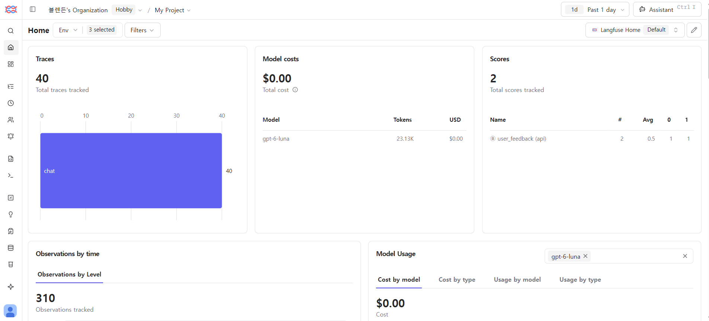
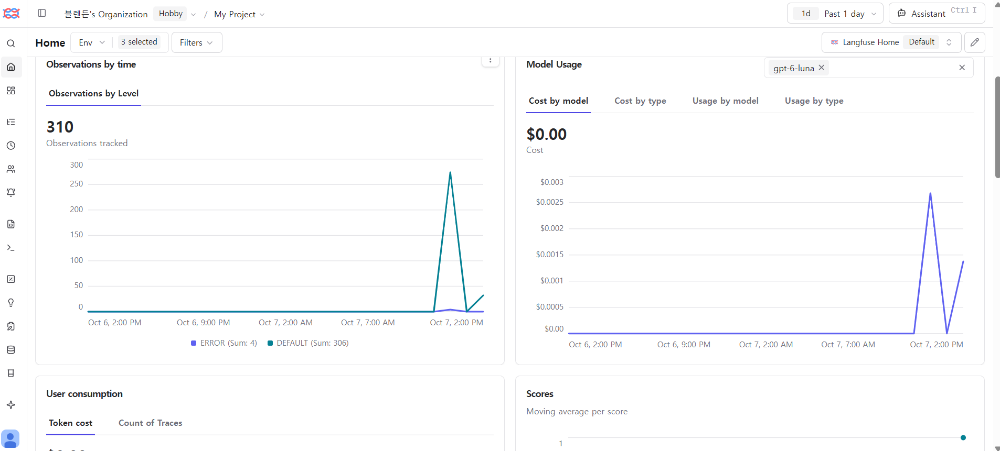
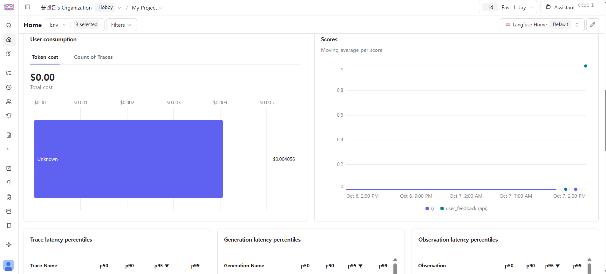
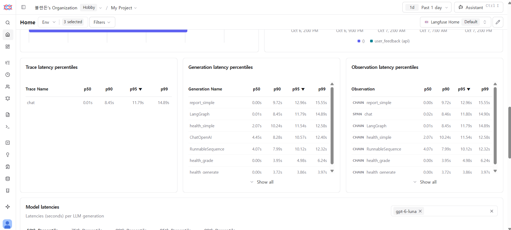

# 운영 모니터링 (Langfuse)

2026-10-07부터 챗봇 실행마다 Langfuse 트레이스를 하나 남긴다. 구현은 `src/tracing.py`, 연결 지점은 `src/chat_graph.py`의 `run_chat()`.

## 무엇을 남기나

| 위치 | 내용 |
| --- | --- |
| 루트 span `chat`의 입력 | 질문의 SHA-256 앞 16자리와 글자 수 |
| 루트 span `chat`의 출력 | `output/chat_runs.jsonl`과 같은 실행 기록: 경로(route), CRAG 판정, 재작성 횟수, 보류 여부, 후보·채택 문서 ID, 모델별 토큰, 지연 |
| 하위 span (LangChain 콜백) | 그래프 노드(classify, health_retrieve, health_grade, …)와 모델 호출마다 시간, 모델 호출의 토큰·비용 |
| 세션 | 브라우저 세션의 무작위 ID를 한 번 더 해시한 값. 같은 탭의 질문들이 한 세션으로 묶인다 |
| 환경 | Streamlit Cloud(`/mount/src/…`)면 `production`, 그 외 `development`. `LANGFUSE_TRACING_ENVIRONMENT`로 바꿀 수 있다 |

## 답변 피드백 (2026-10-07)

- 이번 탭에서 받은 답변 아래에 👍/👎(`st.feedback`)를 보여 준다. 트레이싱이 켜져 있을 때만 보인다.
- 누르면 그 실행의 트레이스에 `user_feedback` BOOLEAN 점수(👍=1, 👎=0)가 붙는다.
- 점수 ID를 `<trace id>-user_feedback`으로 정해 두었다. 그래서 투표를 바꾸면 점수가 하나 더 생기지 않고 덮어써진다. 실제 프로젝트에서 👍 → 👎로 바꾼 뒤 조회해 점수 1개(False)만 남는 것을 확인했다.
- 보내는 값은 숫자 하나와 무작위 트레이스 ID뿐이다. 의견을 글로 받는 칸은 두지 않았다. 글을 받으면 서버에 사용자 텍스트가 남기 때문이다.
- 다시 연 예전 대화에는 버튼이 없다. 대화 기록에는 트레이스 ID를 저장하지 않는다.
- 대시보드에서는 Scores 메뉴나 트레이스 목록의 점수 열에서 경로(route) 태그와 함께 본다. 예: 근거 판정이 `incorrect`(보류)인 답변의 만족도.
- 점수를 읽을 때 새 조직은 `GET /api/public/v3/scores`(SDK: `client.api.scores_v3.get_many_v3`)를 쓴다. 예전 scores API는 막혀 있다.

## 개인정보: 텍스트는 서버를 떠나지 않는다

기존 원칙은 "서버에 대화 원문을 남기지 않는다"이다(대화는 브라우저에만 저장, 실행 로그는 질문 해시만). 트레이싱도 같은 원칙을 따른다.

- Langfuse SDK의 `mask` 훅(`mask_text`)이 SDK가 보내는 모든 입력·출력·메타데이터를 거친다.
- 숫자·참거짓·구조는 남기고, 문자열은 `[masked 32 chars]`처럼 길이만 남긴다.
- 예외는 `SAFE_KEYS`(route, decision, step, 문서 ID, 메시지 role, 모델 이름 등)에 해당하는 값뿐이다. 앱이 정한 값이거나 공개 데이터셋의 ID다.
- 그래서 질문, 답변, 반려견 프로필, 검색된 상담 본문, 대화 이력은 마스킹된다.

**검증:**

- `tests/test_tracing.py`가 실제 Langfuse 클라이언트에 메모리 내 exporter를 붙여 한 번 실행한 뒤, 보낼 span 전체에 질문·답변·문서의 단어(이름, 증상, 전화번호 형식)가 없는지 확인한다.
- 실제 프로젝트에도 질문 3개(건강·시설·보고서)를 보낸 뒤 v2 Observations API로 다시 읽었다. 23개 observation 중 질문 단어가 들어 있는 것은 0개였다(2026-10-07).

## 비용

- `langfuse` import로 메모리 약 11MB 증가(로컬 측정). 키가 없으면 import하지 않는다.
- 전송은 SDK의 백그라운드 스레드가 묶어서 보낸다. 답변 지연에는 영향이 없다.
- 트레이싱 설정·전송이 실패해도 답변은 그대로 나간다. 경고 로그만 남는다.

## 켜고 끄기

- `LANGFUSE_PUBLIC_KEY`, `LANGFUSE_SECRET_KEY`가 있으면 켜진다(`.env` 또는 Streamlit secrets). 주소는 `LANGFUSE_BASE_URL`.
- `LANGFUSE_TRACING_ENABLED=false`면 끈다.
- 테스트 실행 중에는 자동으로 꺼진다. `.env`에 실제 키가 있어도 테스트의 가짜 질문이 프로젝트에 쌓이지 않게 하기 위해서다.
  - 처음 통합할 때 이 처리가 없어서, 전체 테스트 1회분의 가짜 실행(마스킹됨, `development`)이 프로젝트에 들어갔다.

## 알아 둘 점

- **모델 이름:** 통합 직후에는 Langfuse 콜백이 `ChatOpenAI`의 모델 이름을 찾지 못해 generation의 model 칸이 비었다. 2026-10-07에 다시 확인하니 챗봇(Chat Completions)·방문 준비 팀(Responses API)·실험 실행의 generation 139개(production 6, development 133)에 모두 `gpt-6-luna`가 들어 있고, 새로 만든 호출에서도 경고 없이 기록됐다. 그래서 따로 고치지 않는다. 비용 계산도 이 모델 이름으로 이뤄진다.
- **조회 API:** 2026-09-16 이후 만든 Langfuse 조직은 예전 `GET /api/public/traces`를 쓸 수 없다(410). 데이터를 읽을 때는 `GET /api/public/v2/observations`(SDK: `client.api.observations.get_many`)를 쓴다.

## 대시보드 (2026-10-07 캡처)

하루치 기본 대시보드다. 환경은 `production`과 `development`를 모두 포함했다.

- 트레이스 40건, 모델 비용 표에는 `gpt-6-luna` 토큰 23.13K가 잡혔다.
- 비용은 $0.00으로 표시된다. 사용자별 비용 차트로 보면 하루 합계가 $0.004056이라 반올림된 값이다.
- 점수는 `user_feedback` 2건(평균 0.5)이다. 개발 환경 확인용 👎 1건과 배포 앱 👍 1건이다.

- observation 310건 중 ERROR 레벨이 4건이다.
- 처음 통합할 때 테스트가 실제 프로젝트로 보낸 실행(일부러 실패시키는 테스트 포함)이 여기에 섞였다. 지금은 테스트 실행 중 트레이싱이 꺼진다.

- 사용자 ID를 보내지 않으므로 사용자별 비용은 "Unknown" 하나로 모인다. 의도한 동작이다.

- **트레이스 `chat`:** p50 0.01초, p90 8.45초, p99 14.89초. 시설 검색과 일반 대화는 LLM 호출이 없어 거의 0초이고, 건강·보고서 답변이 꼬리를 만든다.
- **노드별 p90:**

  | 노드 | p90 |
  | --- | ---: |
  | `health_simple` | 10.24초 |
  | `report_simple` | 9.72초 |
  | `health_grade`(CRAG 근거 평가) | 3.95초 |
  | `health_generate` | 3.72초 |
  | 모델 호출 `ChatOpenAI` | 8.28초 |

- 다음에 줄일 곳은 모델 호출 자체다. 그래프 오버헤드(`LangGraph` 대비 노드 합)는 작다.

## 평가 데이터셋과 실험 (2026-10-07)

로컬 스크립트와 JSON으로만 하던 평가를 Langfuse 데이터셋과 실험으로도 돌린다. 실행 결과는 Langfuse의 Datasets → 해당 데이터셋 → Runs에서 나란히 비교한다. 재현: `scripts/langfuse_experiments.py`.

| 데이터셋 | 원천 | 기대값 |
| --- | --- | --- |
| `ragdog-crag-60` | `tests/data/crag_eval_questions.json` | 답변(answer) 또는 보류(abstain), 보고서 질문은 정답 페이지 |
| `ragdog-place-routing-36` | `tests/data/place_routing_questions.json` | 경로(route), 시설 종류(kind) |

- **항목 점수:** `correct_behavior`, `gold_page_hit`, `latency_s`, `route_correct`, `kind_correct`
- **실행 점수:** `accuracy`, `over_abstain`(답할 질문을 보류한 비율), `missed_abstain`(보류할 질문에 답한 비율), `latency_p50_s`, `latency_p90_s`
- **실행 메타데이터:** 모델, 추론 강도, 커밋을 남긴다. 실행끼리 무엇이 달랐는지 화면에서 바로 보인다.
- **항목 ID:** 고정했다. 다시 올려도 항목이 늘지 않고 갱신된다.
- **올리는 데이터:** 데이터셋에는 우리 평가 문항(AI Hub 검증 Q&A와 직접 만든 질문)만 올린다. 사용자 대화는 올리지 않는다. 실험 실행의 트레이스도 앱과 같은 마스킹을 거쳐서 답변은 길이로만 보인다. 결과는 점수로 남는다.

**첫 실험 결과**

| 실행 | accuracy | over_abstain | missed_abstain | gold_page_hit | p50 | p90 |
| --- | ---: | ---: | ---: | ---: | ---: | ---: |
| `review-medium` (근거 평가 기본 추론) | 0.900 | 1/38 | 5/22 | 0.667 | 8.5초 | 16.7초 |
| `review-none` (근거 평가 추론 끔, 적용) | 0.883 | 2/38 | 5/22 | 0.667 | **7.0초** | **10.6초** |
| 시설 라우팅 `rules-only` | 경로 1.00, 종류 1.00 | | | | | |
| 시설 라우팅 `rules-plus-llm` | 경로 1.00, 종류 1.00 | | | | | |

- 근거 평가에서 추론을 끄면 p90이 6초 줄었다. 정확도 차이는 60문항 중 1문항이다.
- 질문별 단계 시간 측정(`deployment-resources.md`)과 결론이 같다.
- 두 실행을 같은 데이터셋에서 비교하므로 다음 변경(예: h06 과잉 보류 수정)도 같은 방식으로 잰다.

## 정기 회귀 평가 (2026-10-07)

평가 실험을 사람이 손으로 돌리지 않고 GitHub Actions가 매주 돌린다(`.github/workflows/regression-eval.yml`).

- **언제:** 매주 월요일 09:23(KST), 그리고 Actions 화면에서 수동 실행.
- **무엇을:** CRAG 60문항과 시설 라우팅 36문항을 Langfuse 실험으로 실행한다. 실행 이름은 `ci-<날짜>-<커밋>`이고 환경은 `ci`라서 Langfuse에서 개발·배포 트레이스와 섞이지 않는다.
- **판정:** `scripts/check_regression.py`가 실행 점수를 기준과 비교한다. 하나라도 넘으면 작업이 실패하고 GitHub가 알림을 보낸다. 결과 표는 작업 요약(Job summary)에, 문항별 결과는 아티팩트로 남는다.

| 지표 | 기준 | 병합된 결과 |
| --- | --- | ---: |
| accuracy | ≥ 0.85 | 0.900~0.917 |
| over_abstain | ≤ 0.10 | 0.026 |
| missed_abstain | ≤ 0.35 | 0.18~0.23 |
| latency_p90_s | ≤ 25초 | 12.3~12.6초 |
| route_accuracy / kind_accuracy | ≥ 0.94 / 1.0 | 1.0 / 1.0 |

- 기준은 병합 시 결과보다 조금 느슨하게 잡았다. 같은 설정도 모델 호출마다 60문항 중 1~2문항이 바뀌기 때문이다(실험 기록 참고).
- **비용:** 한 번에 챗봇 답변 약 60회 + 라우팅 판정 36회.
- **필요한 저장소 시크릿:** `OPENAI_API_KEY`, `LANGFUSE_PUBLIC_KEY`, `LANGFUSE_SECRET_KEY`, `LANGFUSE_BASE_URL`. 없으면 첫 단계에서 실패하며 무엇이 빠졌는지 알려 준다.

